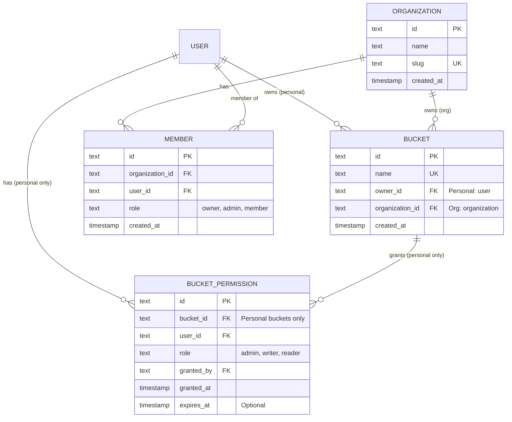
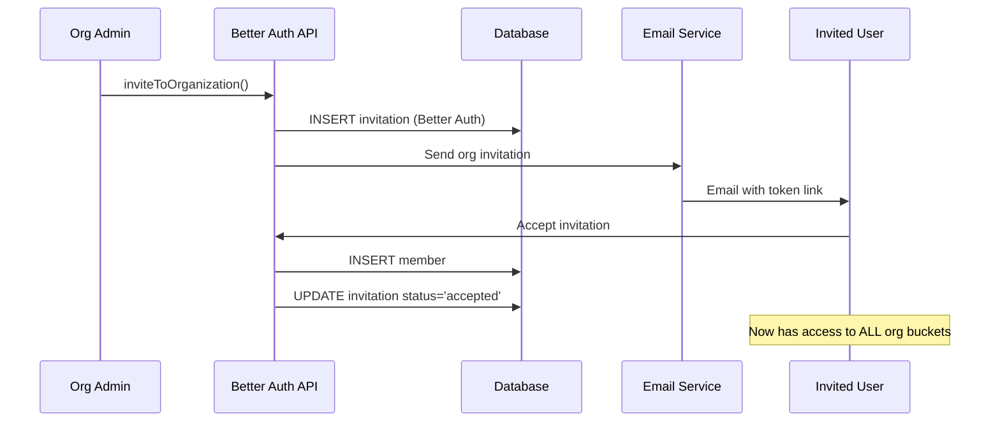

# Storage Bucket Ownership and Permissions System

## Overview

This document defines the bucket ownership and permissions model for Nestio's S3-compatible storage system. The system provides fine-grained access control for buckets and objects, following S3-compatible patterns.

### Two Access Methods

| Method | Primary Use | Authentication | Typical Users |
|--------|-------------|----------------|---------------|
| **API Keys** | Programmatic access | `X-Storage-API-Key` header | Applications, CI/CD, SDKs |
| **User Sessions** | Web UI collaboration | Session cookie / JWT | Humans using web interface |

**Key Insight**: Most storage access is programmatic (apps, CI/CD pipelines) using API keys, not humans using the web UI. API keys are the primary access method.

**For S3-compatible public access features** (Block Public Access, ACLs, canned ACLs, object ownership), see the companion document:
→ **[Storage S3 Public Access and ACLs](./STORAGE-S3-PUBLIC-ACCESS-AND-ACLS.md)**

---

## Core Concepts

### 1. Bucket Ownership and Organization Integration

Buckets in Nestio can be owned by **users** or **organizations**, leveraging Better Auth's native organization system.

#### Bucket Ownership Model:

Every bucket has:
- **owner_id** (REQUIRED): The user who created/owns the bucket
- **organization_id** (OPTIONAL): Links bucket to an organization for grouping/context

**Two types of buckets:**

**A) Personal Buckets** (`organization_id` IS NULL)
- Owner: Individual user
- Access: Owner + explicitly granted users
- Use case: Personal storage, individual projects

**B) Organization Buckets** (`organization_id` IS NOT NULL)
- Owner: Individual user (the creator)
- Organization: Associated with an organization for context
- Access: Owner + explicitly granted users (same as personal)
- Use case: Team storage, but with clear user ownership
- **Important**: Organization membership does NOT grant automatic bucket access

**Database Schema:**
```sql
CREATE TABLE bucket (
  id TEXT PRIMARY KEY,
  name TEXT UNIQUE NOT NULL,
  -- Always set: the user who owns this bucket
  owner_id TEXT NOT NULL REFERENCES user(id) ON DELETE CASCADE,
  -- Optional: organization this bucket belongs to (for grouping/context)
  organization_id TEXT REFERENCES organization(id) ON DELETE CASCADE,
  created_at TIMESTAMP DEFAULT NOW(),
  updated_at TIMESTAMP DEFAULT NOW()
);

CREATE INDEX bucket_owner_id_idx ON bucket(owner_id);
CREATE INDEX bucket_organization_id_idx ON bucket(organization_id);
```

**Better Auth Organization Structure:**
```typescript
// From Better Auth schema
interface Organization {
  id: string;
  name: string;
  slug: string;
  logo?: string | null;
  metadata?: Record<string, unknown>;
  createdAt: Date;
}

interface Member {
  id: string;
  organizationId: string;
  userId: string;
  role: 'owner' | 'admin' | 'member';  // Better Auth roles
  createdAt: Date;
}

interface Invitation {
  id: string;
  organizationId: string;
  email: string;
  role: 'admin' | 'member';            // Cannot invite as owner
  status: 'pending' | 'accepted' | 'rejected' | 'canceled';
  expiresAt: Date;
  inviterId: string;
}
```

---

## API Key System (Primary Access Method)

API keys are the **primary way applications and services access storage**. They provide scoped, time-limited access to specific buckets and actions.

### Why API Keys First?

| Use Case | Access Method | Percentage |
|----------|---------------|------------|
| Web applications uploading files | API Key | 40% |
| CI/CD pipelines deploying assets | API Key | 25% |
| Backend services | API Key | 20% |
| Mobile apps | API Key | 10% |
| **Human collaboration (Web UI)** | **User Session** | **5%** |

### API Key Database Schema

```sql
CREATE TABLE storage_api_key (
  id TEXT PRIMARY KEY DEFAULT gen_random_uuid(),
  
  -- Key identification (key itself is never stored, only hash)
  key_hash TEXT UNIQUE NOT NULL,      -- SHA-256 hash of the full key
  key_prefix TEXT NOT NULL,           -- First 8 chars for UI display (e.g., "ak_prod_x")
  name TEXT NOT NULL,                 -- User-given name (e.g., "Production App Key")
  
  -- Ownership
  user_id TEXT NOT NULL REFERENCES user(id) ON DELETE CASCADE,
  organization_id TEXT REFERENCES organization(id) ON DELETE CASCADE,
  
  -- Scoped Permissions
  bucket_ids TEXT[],                  -- NULL = all user's buckets, or specific bucket IDs
  allowed_actions TEXT[] NOT NULL,    -- ['read'] or ['read', 'write'] or ['read', 'write', 'delete']
  
  -- Lifecycle
  created_at TIMESTAMP DEFAULT NOW(),
  expires_at TIMESTAMP,               -- Optional expiration
  last_used_at TIMESTAMP,
  revoked_at TIMESTAMP,               -- Soft delete (NULL = active)
  
  -- Rate limiting
  rate_limit_per_minute INTEGER DEFAULT 1000,
  
  -- Metadata
  description TEXT,
  created_by_ip TEXT,
  last_used_ip TEXT
);

CREATE INDEX storage_api_key_user_id_idx ON storage_api_key(user_id);
CREATE INDEX storage_api_key_hash_idx ON storage_api_key(key_hash);
CREATE INDEX storage_api_key_prefix_idx ON storage_api_key(key_prefix);
CREATE INDEX storage_api_key_org_idx ON storage_api_key(organization_id);
```

### API Key Format

```
ak_{environment}_{random_32_chars}

Examples:
- ak_prod_a1b2c3d4e5f6g7h8i9j0k1l2m3n4o5p6
- ak_dev_x9y8z7w6v5u4t3s2r1q0p9o8n7m6l5k4
- ak_test_abcdefghijklmnopqrstuvwxyz123456
```

**Key components:**
- `ak_` - API key prefix (constant)
- `{environment}` - User-defined tag (prod/dev/test/staging)
- `{random}` - 32 cryptographically random characters

### API Key Generation

```typescript
import { randomBytes, createHash } from 'crypto';

interface CreateApiKeyInput {
  name: string;
  userId: string;
  organizationId?: string;
  bucketIds?: string[];           // NULL = all buckets
  allowedActions: ('read' | 'write' | 'delete')[];
  expiresInDays?: number;
  environment?: string;           // 'prod' | 'dev' | 'test' | 'staging'
}

async function createApiKey(input: CreateApiKeyInput): Promise<{
  apiKey: string;      // Show ONCE to user
  keyInfo: ApiKeyInfo; // Stored info (no secret)
}> {
  // 1. Generate random key
  const environment = input.environment || 'prod';
  const randomPart = randomBytes(24).toString('base64url'); // 32 chars
  const fullKey = `ak_${environment}_${randomPart}`;
  
  // 2. Hash for storage (never store plain key)
  const keyHash = createHash('sha256').update(fullKey).digest('hex');
  
  // 3. Extract prefix for display
  const keyPrefix = fullKey.substring(0, 12); // "ak_prod_a1b2"
  
  // 4. Calculate expiration
  let expiresAt: Date | null = null;
  if (input.expiresInDays) {
    expiresAt = new Date();
    expiresAt.setDate(expiresAt.getDate() + input.expiresInDays);
  }
  
  // 5. Store in database
  const keyInfo = await db.insert(schema.storageApiKey).values({
    keyHash,
    keyPrefix,
    name: input.name,
    userId: input.userId,
    organizationId: input.organizationId,
    bucketIds: input.bucketIds,
    allowedActions: input.allowedActions,
    expiresAt,
  }).returning();
  
  // 6. Return full key (SHOW ONCE) and stored info
  return {
    apiKey: fullKey,  // ⚠️ Only time user sees full key
    keyInfo: keyInfo[0],
  };
}
```

### API Key Validation

```typescript
async function validateApiKey(apiKey: string): Promise<ValidatedKey | null> {
  // 1. Hash the provided key
  const keyHash = createHash('sha256').update(apiKey).digest('hex');
  
  // 2. Find in database
  const key = await db.query.storageApiKey.findFirst({
    where: and(
      eq(schema.storageApiKey.keyHash, keyHash),
      isNull(schema.storageApiKey.revokedAt)
    ),
  });
  
  if (!key) {
    return null; // Invalid or revoked
  }
  
  // 3. Check expiration
  if (key.expiresAt && new Date() > key.expiresAt) {
    return null; // Expired
  }
  
  // 4. Update last used
  await db.update(schema.storageApiKey)
    .set({ 
      lastUsedAt: new Date(),
      lastUsedIp: getCurrentIp(),
    })
    .where(eq(schema.storageApiKey.id, key.id));
  
  return key;
}
```

### API Key Permission Check

```typescript
async function checkApiKeyAccess(
  apiKey: ValidatedKey,
  bucketId: string,
  action: 'read' | 'write' | 'delete'
): Promise<boolean> {
  // 1. Check action permission
  if (!apiKey.allowedActions.includes(action)) {
    return false;
  }
  
  // 2. Check bucket scope
  if (apiKey.bucketIds !== null) {
    // Key is scoped to specific buckets
    if (!apiKey.bucketIds.includes(bucketId)) {
      return false;
    }
  } else {
    // Key has access to all owner's buckets
    // Verify owner actually owns this bucket
    const bucket = await getBucketById(bucketId);
    if (bucket.ownerId !== apiKey.userId) {
      return false;
    }
  }
  
  return true;
}
```

### API Key Middleware

```typescript
// Middleware: Authenticate via API key
export const requireApiKey = () => {
  return async ({ request, next }) => {
    const apiKeyHeader = request.headers.get('X-Storage-API-Key');
    
    if (!apiKeyHeader) {
      throw new UnauthorizedException('API key required. Set X-Storage-API-Key header.');
    }
    
    const validatedKey = await validateApiKey(apiKeyHeader);
    
    if (!validatedKey) {
      throw new UnauthorizedException('Invalid or expired API key');
    }
    
    // Add to context for handlers
    return next({ apiKey: validatedKey });
  };
};

// Usage in controller
@Implement(storageContract.object.upload)
objectUpload() {
  return implement(storageContract.object.upload)
    .use(requireApiKey())
    .handler(async ({ input, context }) => {
      const { apiKey } = context;
      
      // Verify key has access to this bucket and action
      const hasAccess = await checkApiKeyAccess(apiKey, input.bucketId, 'write');
      
      if (!hasAccess) {
        throw new ForbiddenException('API key lacks permission for this operation');
      }
      
      return await this.storageService.upload(input);
    });
}
```

### API Key Management Endpoints

```typescript
// packages/contracts/api/modules/storage/api-keys.ts
import { oc } from '@orpc/contract';
import { z } from 'zod';

const apiKeyInfoSchema = z.object({
  id: z.string(),
  keyPrefix: z.string(),
  name: z.string(),
  bucketIds: z.array(z.string()).nullable(),
  allowedActions: z.array(z.enum(['read', 'write', 'delete'])),
  createdAt: z.string(),
  expiresAt: z.string().nullable(),
  lastUsedAt: z.string().nullable(),
});

// Create API key
export const createApiKeyContract = oc
  .route({ method: 'POST', path: '/api-keys' })
  .input(z.object({
    name: z.string().min(1).max(100),
    bucketIds: z.array(z.string()).optional(), // NULL = all buckets
    allowedActions: z.array(z.enum(['read', 'write', 'delete'])),
    expiresInDays: z.number().int().min(1).max(365).optional(),
    environment: z.enum(['prod', 'dev', 'test', 'staging']).default('prod'),
  }))
  .output(z.object({
    apiKey: z.string(),  // Full key (shown once)
    keyInfo: apiKeyInfoSchema,
  }));

// List API keys
export const listApiKeysContract = oc
  .route({ method: 'GET', path: '/api-keys' })
  .input(z.object({}))
  .output(z.object({
    keys: z.array(apiKeyInfoSchema),
    total: z.number(),
  }));

// Revoke API key
export const revokeApiKeyContract = oc
  .route({ method: 'DELETE', path: '/api-keys/{keyId}' })
  .input(z.object({ keyId: z.string() }))
  .output(z.object({ success: z.boolean() }));

// Regenerate API key (revoke old + create new with same settings)
export const regenerateApiKeyContract = oc
  .route({ method: 'POST', path: '/api-keys/{keyId}/regenerate' })
  .input(z.object({ keyId: z.string() }))
  .output(z.object({
    apiKey: z.string(),  // New key (shown once)
    keyInfo: apiKeyInfoSchema,
  }));
```

### Real-World Use Cases

#### Use Case 1: Web Application Storage

```typescript
// Setup (done once in admin UI):
// 1. Developer creates bucket "prod-uploads"
// 2. Generates API key:
//    - Name: "Production App"
//    - Bucket: prod-uploads
//    - Actions: read, write
//    - Expiry: Never
// 3. Adds key to environment variables

// In app backend:
const storage = new StorageClient({
  endpoint: process.env.STORAGE_ENDPOINT,
  apiKey: process.env.STORAGE_API_KEY,
});

// Upload user avatar
app.post('/api/upload-avatar', async (req, res) => {
  const file = req.files.avatar;
  
  await storage.upload({
    bucket: 'prod-uploads',
    key: `avatars/${req.user.id}.jpg`,
    data: file.buffer,
    contentType: 'image/jpeg',
  });
  
  const url = await storage.getPresignedUrl({
    bucket: 'prod-uploads',
    key: `avatars/${req.user.id}.jpg`,
    expiresIn: 86400, // 24 hours
  });
  
  res.json({ avatarUrl: url });
});
```

#### Use Case 2: CI/CD Pipeline

```yaml
# GitHub Actions workflow
name: Deploy Static Assets

on:
  push:
    branches: [main]

jobs:
  deploy:
    runs-on: ubuntu-latest
    steps:
      - uses: actions/checkout@v4
      
      - name: Build
        run: npm run build
      
      - name: Deploy to Storage
        env:
          STORAGE_API_KEY: ${{ secrets.STORAGE_DEPLOY_KEY }}
        run: |
          # Using CLI tool
          npx @nestio/storage-cli sync ./dist s3://static-assets/ \
            --delete \
            --endpoint $STORAGE_ENDPOINT
```

#### Use Case 3: Multi-tenant SaaS

```typescript
// When customer signs up:
async function onboardCustomer(customerId: string) {
  // 1. Create customer bucket
  const bucket = await storage.bucket.create({
    name: `customer-${customerId}`,
  });
  
  // 2. Generate customer-specific API key
  const { apiKey, keyInfo } = await storage.apiKeys.create({
    name: `Customer ${customerId} API Key`,
    bucketIds: [bucket.id],  // Scoped to their bucket only
    allowedActions: ['read', 'write'],
    expiresInDays: 365,
  });
  
  // 3. Store key info in customer settings
  await db.update(customers)
    .set({ storageApiKey: apiKey })  // Or encrypt it
    .where(eq(customers.id, customerId));
  
  return { bucket, apiKey };
}

// Customer's app uses their key
const customerStorage = new StorageClient({
  apiKey: customer.storageApiKey,
});

// Can only access their bucket (scoped)
await customerStorage.upload({
  bucket: `customer-${customerId}`,
  key: 'data.json',
  data: JSON.stringify(data),
});
```

#### Use Case 4: Temporary Contractor Access

```typescript
// Grant contractor 90-day access
const { apiKey } = await storage.apiKeys.create({
  name: 'Contractor John - Q1 2026',
  bucketIds: ['project-alpha-bucket-id'],
  allowedActions: ['read', 'write'],  // No delete
  expiresInDays: 90,
  environment: 'prod',
});

// Send key to contractor securely
await sendSecureEmail({
  to: 'john@contractor.com',
  subject: 'Storage Access for Project Alpha',
  body: `Your API key: ${apiKey}\n\nExpires in 90 days.`,
});

// After 90 days, key auto-expires (no cleanup needed)
```

#### Use Case 5: Read-Only Public CDN

```typescript
// Create read-only key for CDN edge servers
const { apiKey } = await storage.apiKeys.create({
  name: 'CDN Edge Servers',
  bucketIds: ['public-assets-bucket-id'],
  allowedActions: ['read'],  // Read ONLY
  expiresInDays: null,       // Never expires
});

// CDN config (can be embedded in edge workers)
// Even if key leaks, can only read from specific bucket
```

---

## User Session Access (Secondary - Web UI)

For human users interacting via the web interface, user session authentication is used. This is for collaboration features like sharing buckets with team members.

### When to Use User Sessions

- **Browsing buckets** in web UI
- **Inviting collaborators** to buckets
- **Managing bucket settings**
- **Viewing activity logs**

### User Permission System

User-to-user permissions use the `bucket_permission` table (see below). This allows bucket owners to share access with other authenticated users through the web interface.

---

## Permission System Integration

This storage permission system leverages the **@repo/auth permission builder** to maintain consistency with the platform's existing permission infrastructure.

### Permission Builder Architecture

The storage permissions are defined using the same `PermissionBuilder` pattern used for platform and organization permissions:

```typescript
// packages/contracts/api/modules/storage/permissions.ts
import { PermissionBuilder } from "@repo/auth/permissions";

/**
 * Storage permission builder
 * Defines resources and actions for S3-compatible storage
 */
const storageBuilder = new PermissionBuilder()
  .resources(({ actions }) => ({
    bucket: actions([
      'list',         // List buckets
      'create',       // Create bucket
      'read',         // Get bucket details
      'update',       // Update bucket settings
      'delete',       // Delete bucket
      'manage-acl',   // Grant/revoke permissions
    ] as const),
    
    object: actions([
      'list',         // List objects
      'read',         // Get object / HEAD request
      'write',        // Upload object / multipart
      'delete',       // Delete object
      'copy',         // Copy object
      'metadata',     // Read/write object metadata
    ] as const),
    
    presigned: actions([
      'generate-get',  // Generate download URLs
      'generate-put',  // Generate upload URLs
      'generate-post', // Generate POST URLs
    ] as const),
  }))
  .role('owner').allPermissions()
  .roles(({ permissions }) => ({
    admin: permissions({
      bucket: ['list', 'create', 'read', 'update', 'delete', 'manage-acl'],
      object: ['list', 'read', 'write', 'delete', 'copy', 'metadata'],
      presigned: ['generate-get', 'generate-put', 'generate-post'],
    }),
    
    writer: permissions({
      bucket: ['list', 'read'],
      object: ['list', 'read', 'write', 'metadata'],
      presigned: ['generate-put', 'generate-post'],
    }),
    
    reader: permissions({
      bucket: ['list', 'read'],
      object: ['list', 'read'],
      presigned: ['generate-get'],
    }),
  }));

export const storagePermissionConfig = storageBuilder.build();
export const { 
  statement: storageStatement,
  ac: storageAc,
  roles: storageRoles,
  schemas: storageSchemas,
} = storagePermissionConfig;
```

### Permission Roles

| Role | Bucket Access | Object Access | Presigned URLs | Use Case |
|------|--------------|---------------|----------------|----------|
| **owner** | Full control | Full control | All types | Bucket creator |
| **admin** | Full (except delete bucket) | Full control | All types | Shared admin |
| **writer** | Read-only | Read + Write | Put/Post only | Upload contributor |
| **reader** | Read-only | Read-only | Get only | Read-only viewer |

### S3-Compatible Action Mapping

The permission actions map to S3 API operations:

| Permission Action | S3 Operations |
|------------------|---------------|
| `bucket:list` | ListAllMyBuckets |
| `bucket:create` | CreateBucket |
| `bucket:read` | GetBucketLocation, HeadBucket |
| `bucket:delete` | DeleteBucket |
| `bucket:manage-acl` | PutBucketAcl, GetBucketAcl |
| `object:list` | ListObjects, ListObjectsV2 |
| `object:read` | GetObject, HeadObject |
| `object:write` | PutObject, CreateMultipartUpload, UploadPart, CompleteMultipartUpload |
| `object:delete` | DeleteObject, DeleteObjects |
| `object:copy` | CopyObject |
| `presigned:generate-get` | Generate presigned GET URLs |
| `presigned:generate-put` | Generate presigned PUT URLs |
| `presigned:generate-post` | Generate presigned POST URLs |

---

## Access Control Implementation

### Unified Authentication Flow

The storage system supports **two authentication methods** that converge to the same permission check:

```typescript
/**
 * Authentication result - same structure regardless of method
 */
interface AuthContext {
  type: 'api_key' | 'user_session';
  userId: string;              // Owner of the key or session user
  
  // API Key specific (when type === 'api_key')
  apiKey?: {
    id: string;
    bucketIds: string[] | null;     // Scoped buckets or all
    allowedActions: string[];       // ['read'] or ['read', 'write', 'delete']
  };
  
  // User Session specific (when type === 'user_session')
  session?: {
    id: string;
    user: User;
  };
}

/**
 * Unified permission check - handles both auth types
 */
async function checkStorageAccess(
  context: AuthContext,
  bucketId: string,
  action: 'read' | 'write' | 'delete'
): Promise<boolean> {
  const bucket = await getBucketById(bucketId);
  
  // ========== API KEY AUTH ==========
  if (context.type === 'api_key') {
    const { apiKey, userId } = context;
    
    // 1. Check action is allowed by key
    if (!apiKey.allowedActions.includes(action)) {
      return false;
    }
    
    // 2. Check bucket scope
    if (apiKey.bucketIds !== null) {
      // Key scoped to specific buckets
      if (!apiKey.bucketIds.includes(bucketId)) {
        return false;
      }
    } else {
      // Key has access to all owner's buckets
      if (bucket.ownerId !== userId) {
        return false;
      }
    }
    
    return true;
  }
  
  // ========== USER SESSION AUTH ==========
  if (context.type === 'user_session') {
    const { userId } = context;
    
    // 1. Check if user is bucket owner (full access)
    if (bucket.ownerId === userId) {
      return true;
    }
    
    // 2. Check explicit permission grant
    const permission = await getBucketPermission(bucketId, userId);
    
    if (!permission) {
      return false;
    }
    
    // 3. Check expiration
    if (permission.expiresAt && new Date() > permission.expiresAt) {
      await deleteBucketPermission(permission.id);
      return false;
    }
    
    // 4. Map action to permission check
    const actionToPermission = {
      read: ['reader', 'writer', 'admin'],
      write: ['writer', 'admin'],
      delete: ['admin'],
    };
    
    return actionToPermission[action].includes(permission.role);
  }
  
  return false;
}
```

### Authentication Middleware

```typescript
// Combined middleware: accepts API key OR user session
export const requireStorageAuth = () => {
  return async ({ request, next }) => {
    // 1. Check for API key first (preferred for programmatic access)
    const apiKeyHeader = request.headers.get('X-Storage-API-Key');
    
    if (apiKeyHeader) {
      const validatedKey = await validateApiKey(apiKeyHeader);
      
      if (!validatedKey) {
        throw new UnauthorizedException('Invalid or expired API key');
      }
      
      return next({
        auth: {
          type: 'api_key',
          userId: validatedKey.userId,
          apiKey: validatedKey,
        } as AuthContext,
      });
    }
    
    // 2. Fall back to user session (for web UI)
    const session = await getSession(request);
    
    if (session) {
      return next({
        auth: {
          type: 'user_session',
          userId: session.user.id,
          session,
        } as AuthContext,
      });
    }
    
    throw new UnauthorizedException(
      'Authentication required. Provide X-Storage-API-Key header or sign in.'
    );
  };
};
```

### Controller Using Unified Auth

```typescript
@Implement(storageContract.object.upload)
objectUpload() {
  return implement(storageContract.object.upload)
    .use(requireStorageAuth())  // Works with API key OR user session
    .handler(async ({ input, context }) => {
      const { auth } = context;
      
      // Check permission using unified function
      const hasAccess = await checkStorageAccess(
        auth,
        input.bucketId,
        'write'
      );
      
      if (!hasAccess) {
        throw new ForbiddenException('No write access to this bucket');
      }
      
      return await this.storageService.upload(input);
    });
}
```

---

### Phase 1: Owner-Only Access (Simple)

**Rules:**
- Only the bucket owner can perform **any** operations on the bucket
- No sharing, no granular permissions
- Simplest security model

**Implementation:**
```typescript
class StorageService {
  async verifyBucketOwnership(bucketName: string, userId: string): Promise<void> {
    const bucket = await this.repository.getBucketByName(bucketName);
    
    if (!bucket) {
      throw new NotFoundException(`Bucket ${bucketName} not found`);
    }
    
    if (bucket.ownerId !== userId) {
      throw new ForbiddenException(`You do not own bucket ${bucketName}`);
    }
  }
  
  // Apply to all mutating operations:
  async deleteBucket(bucketName: string, userId: string) {
    await this.verifyBucketOwnership(bucketName, userId);
    // ... proceed with deletion
  }
  
  async uploadObject(bucket: string, key: string, userId: string, data: Buffer) {
    await this.verifyBucketOwnership(bucket, userId);
    // ... proceed with upload
  }
}
```

**Operations Requiring Ownership:**
- `bucket.delete` - Delete bucket
- `object.upload` - Upload object
- `object.delete` - Delete object
- `object.batchDelete` - Batch delete objects
- `object.copy` - Copy object (both source and destination buckets)
- `multipart.initiate` - Initiate multipart upload
- `multipart.uploadPart` - Upload part
- `multipart.complete` - Complete multipart upload
- `multipart.abort` - Abort multipart upload

**Operations Allowed Without Ownership (Read-Only):**
- `bucket.list` - List user's own buckets (filtered by ownerId)
- `bucket.exists` - Check if bucket exists (ownership not checked)
- `object.list` - List objects (ownership required)
- `object.stat` - Get object metadata (ownership required)
- `object.head` - HEAD request (ownership required)
- `presigned.*` - Generate presigned URLs (ownership required to generate)

---

### Phase 2: Permission System (All Buckets)

**All buckets use the same `bucket_permission` table for sharing:**

```sql
-- Universal permission table for sharing buckets
CREATE TABLE bucket_permission (
  id TEXT PRIMARY KEY,
  bucket_id TEXT NOT NULL REFERENCES bucket(id) ON DELETE CASCADE,
  user_id TEXT NOT NULL REFERENCES user(id) ON DELETE CASCADE,
  role TEXT NOT NULL, -- 'admin' | 'writer' | 'reader' (no 'owner')
  granted_by TEXT NOT NULL REFERENCES user(id),
  granted_at TIMESTAMP DEFAULT NOW(),
  expires_at TIMESTAMP, -- Optional expiration
  
  UNIQUE(bucket_id, user_id)
);

CREATE INDEX bucket_permission_bucket_user_idx ON bucket_permission(bucket_id, user_id);
CREATE INDEX bucket_permission_user_idx ON bucket_permission(user_id);
CREATE INDEX bucket_permission_expires_at_idx ON bucket_permission(expires_at) 
  WHERE expires_at IS NOT NULL;
```

**Permission Model:**

- **Bucket owner** (`owner_id`): Always has full access
- **Granted users**: Explicit permissions via `bucket_permission` table
- **Organization association** (`organization_id`): Just for grouping/context, no automatic permissions
```typescript
import { storageAc, storageRoles } from '@repo/api-contracts/storage/permissions';
import { organizationAc } from '@repo/auth/permissions';
import type { AuthCoreService } from '@/core/modules/auth/services/auth-core.service';

class StorageService {
  constructor(private readonly authService: AuthCoreService) {}
  
  /**
   * Check if user has specific action permission on bucket
   * Handles both personal and organization buckets
   */
  async checkBucketAction(
    bucketName: string,
    userId: string,
    resource: 'bucket' | 'object' | 'presigned',
    action: string
  ): Promise<boolean> {
    const bucket = await this.repository.getBucketByName(bucketName);
    
    if (!bucket) {
      return false;
    }
    
    // ===== CHECK OWNERSHIP =====
    // Bucket owner always has full access (regardless of org association)
    if (bucket.ownerId === userId) {
      return true;
    }
    
    // ===== CHECK EXPLICIT PERMISSIONS =====
    // Check if user has explicit permission grant
    const permission = await this.repository.getBucketPermission(bucket.id, userId);
    
    if (!permission) {
      return false; // No permission found
    }
    
    // Check expiration
    if (permission.expiresAt && new Date() > permission.expiresAt) {
      await this.repository.deletePermission(permission.id);
      return false;
    }
    
    // Use permission builder to check access
    return storageAc.can(storageRoles[permission.role], resource, action);
  }
  
  /**
   * Verify user has ALL required actions for a resource
   */
  async verifyBucketAccess(
    bucketName: string,
    userId: string,
    resource: 'bucket' | 'object' | 'presigned',
    actions: string[]
  ): Promise<void> {
    for (const action of actions) {
      const hasAccess = await this.checkBucketAction(
        bucketName,
        userId,
        resource,
        action
      );
      
      if (!hasAccess) {
        throw new ForbiddenException(
          `You do not have '${resource}:${action}' permission on bucket '${bucketName}'`
        );
      }
    }
  }
  
  /**
   * Grant a role to a user on a bucket
   */
  async grantBucketRole(
    bucketName: string,
    granterId: string,
    granteeUserId: string,
    role: 'admin' | 'writer' | 'reader'
  ): Promise<void> {
    // Only bucket owner or admins can grant permissions
    const canManageAcl = await this.checkBucketAction(
      bucketName,
      granterId,
      'bucket',
      'manage-acl'
    );
    
    if (!canManageAcl) {
      throw new ForbiddenException(
        'You do not have permission to manage bucket access control'
      );
    }
    
    // Validate the role using the permission builder
    if (!storageRoles[role]) {
      throw new BadRequestException(`Invalid role: ${role}`);
    }
    
    const bucket = await this.repository.getBucketByName(bucketName);
    
    await this.repository.createBucketPermission({
      bucketId: bucket.id,
      userId: granteeUserId,
      role,
      grantedBy: granterId,
    });
  }
}
```

---

## API Endpoints (Future - Phase 2)

### Grant Permissions

**Contract:**
```typescript
// packages/contracts/api/modules/storage/bucket/grant-role.ts
import { storageSchemas } from '../permissions';

export const bucketGrantRoleContract = oc
  .route({
    method: "POST",
    path: "/{bucketName}/permissions",
  })
  .input(
    z.object({
      bucketName: z.string(),
      userId: z.string(),
      role: storageSchemas.role, // Zod enum from permission builder
    })
  )
  .output(
    z.object({
      success: z.boolean(),
      message: z.string(),
    })
  );
```

**Controller:**
```typescript
@Implement(storageContract.bucket.grantRole)
bucketGrantRole() {
  return implement(storageContract.bucket.grantRole)
    .use(requireAuth())
    .handler(async ({ input, context }) => {
      await this.storageService.grantBucketRole(
        input.bucketName,
        context.auth.user.id,
        input.userId,
        input.role
      );
      
      return {
        success: true,
        message: `Granted '${input.role}' role to user ${input.userId}`,
      };
    });
}
```

### List Permissions

**Contract:**
```typescript
import { storageSchemas } from '../permissions';

export const bucketListPermissionsContract = oc
  .route({
    method: "GET",
    path: "/{bucketName}/permissions",
  })
  .input(z.object({ bucketName: z.string() }))
  .output(
    z.object({
      permissions: z.array(
        z.object({
          userId: z.string(),
          userName: z.string(),
          userEmail: z.string(),
          role: storageSchemas.role, // 'owner' | 'admin' | 'writer' | 'reader'
          grantedBy: z.string(),
          grantedAt: z.string(),
        })
      ),
    })
  );
```

### Revoke Permission

**Contract:**
```typescript
import { storageSchemas } from '../permissions';

export const bucketRevokeRoleContract = oc
  .route({
    method: "DELETE",
    path: "/{bucketName}/permissions/{userId}",
  })
  .input(
    z.object({
      bucketName: z.string(),
      userId: z.string(),
    })
  )
  .output(
    z.object({
      success: z.boolean(),
      message: z.string(),
    })
  );
```

---

## Presigned URLs and Permissions

### Current Behavior (Owner-Only)

Presigned URLs can only be generated by the bucket owner:

```typescript
async generatePresignedGetUrl(bucket: string, key: string, userId: string) {
  // Verify ownership before generating URL
  await this.verifyBucketOwnership(bucket, userId);
  
  const token = this.createPresignedToken({
    bucket,
    key,
    operation: 'GET',
    expiresAt: Date.now() + expirySeconds * 1000,
  });
  
  return { url: `/storage/presigned/${token}` };
}
```

### Future Behavior (With Permissions)

Users with appropriate role can generate presigned URLs:

```typescript
async generatePresignedGetUrl(bucket: string, key: string, userId: string) {
  // Check 'presigned:generate-get' permission
  await this.verifyBucketAccess(bucket, userId, 'presigned', ['generate-get']);
  
  const token = this.createPresignedToken({
    bucket,
    key,
    operation: 'GET',
    expiresAt: Date.now() + expirySeconds * 1000,
  });
  
  return { url: `/storage/presigned/${token}` };
}

async generatePresignedPutUrl(bucket: string, key: string, userId: string) {
  // Check 'presigned:generate-put' permission (writers and above)
  await this.verifyBucketAccess(bucket, userId, 'presigned', ['generate-put']);
  
  // ... proceed with URL generation
}
```

**Token Validation:**
- Presigned URLs do NOT require authentication (token-based access)
- Token embeds: bucket, key, operation, expiry
- Token signature prevents tampering
- No permission check at download time (checked at generation time)

---

## Integration with Auth Context

### Controller Pattern

All storage endpoints use `requireAuth()` middleware and permission checks:

```typescript
@Implement(storageContract.object.upload)
objectUpload() {
  return implement(storageContract.object.upload)
    .use(requireAuth()) // ✅ Injects context.auth.user
    .handler(async ({ input, context }) => {
      const userId = context.auth.user.id;
      
      // Phase 1: Verify ownership
      await this.storageService.verifyBucketOwnership(input.bucket, userId);
      
      // Phase 2: Check 'object:write' permission using access control
      await this.storageService.verifyBucketAccess(
        input.bucket,
        userId,
        'object',
        ['write']
      );
      
      // ... proceed with upload
    });
}
```

### Repository Pattern

```typescript
class StorageRepository {
  async getBucketByName(name: string) {
    return this.db.query.bucket.findFirst({
      where: eq(schema.bucket.name, name),
    });
  }
  
  async getUserBuckets(userId: string) {
    // Phase 1: Owner buckets only
    return this.db.query.bucket.findMany({
      where: eq(schema.bucket.ownerId, userId),
    });
    
    // Phase 2: Owner buckets + granted buckets
    // return this.db
    //   .select()
    //   .from(schema.bucket)
    //   .where(
    //     or(
    //       eq(schema.bucket.ownerId, userId),
    //       inArray(
    //         schema.bucket.id,
    //         this.db.select({ bucketId: schema.bucketPermission.bucketId })
    //           .from(schema.bucketPermission)
    //           .where(eq(schema.bucketPermission.userId, userId))
    //       )
    //     )
    //   );
  }
}
```

---

## Error Handling

### Standard Errors

| HTTP Status | Exception | When |
|------------|-----------|------|
| **401 Unauthorized** | `UnauthorizedException` | No auth token provided |
| **403 Forbidden** | `ForbiddenException` | User authenticated but lacks permission |
| **404 Not Found** | `NotFoundException` | Bucket or object does not exist |
| **409 Conflict** | `ConflictException` | Bucket name already exists |

### Error Messages

```typescript
// Ownership verification
throw new ForbiddenException(
  `You do not own bucket '${bucketName}'. Only the owner can perform this operation.`
);

// Permission check (Phase 2)
throw new ForbiddenException(
  `You do not have ${permission} permission on bucket '${bucketName}'.`
);

// Bucket not found
throw new NotFoundException(
  `Bucket '${bucketName}' does not exist.`
);
```

---

## Implementation Checklist

### Phase 1: Owner-Only Access (Current Sprint)

- [x] Database schema with `bucket.ownerId` and index
- [x] Multipart expiry index added
- [ ] Create storage permission builder in `packages/contracts/api/modules/storage/permissions.ts`
  - [ ] Define bucket/object/presigned resources with actions
  - [ ] Define owner/admin/writer/reader roles
  - [ ] Export `storageAc`, `storageRoles`, `storageSchemas`
- [ ] `StorageService.verifyBucketOwnership()` method
- [ ] Apply ownership check to all mutating operations:
  - [ ] `deleteBucket()`
  - [ ] `uploadObject()`
  - [ ] `deleteObject()`
  - [ ] `batchDeleteObjects()`
  - [ ] `copyObject()` (source and destination)
  - [ ] `initiateMultipartUpload()`
  - [ ] `uploadPart()`
  - [ ] `completeMultipartUpload()`
  - [ ] `abortMultipartUpload()`
  - [ ] `generatePresignedGetUrl()`
  - [ ] `generatePresignedPutUrl()`
  - [ ] `generatePresignedPost()`
- [ ] Update `listBuckets()` to filter by `ownerId`
- [ ] Add ownership tests
- [ ] Update API documentation

### Phase 2: Shared Buckets with Permission Builder (Future)

- [ ] Create `bucket_permission` table with role column
- [ ] Implement `checkBucketAction()` method using `storageAc`
- [ ] Implement `verifyBucketAccess()` method
- [ ] Replace `verifyBucketOwnership()` with `verifyBucketAccess()` calls
- [ ] Add `grantBucketRole()` contract and handler
- [ ] Add `revokeBucketRole()` contract and handler
- [ ] Add `listBucketPermissions()` contract and handler
- [ ] Update `listBuckets()` to include buckets where user has any role
- [ ] Add permission inheritance for objects
- [ ] Add bulk role operations
- [ ] Add permission audit logging
- [ ] Create React hooks using permission system
- [ ] Update documentation

---

## Permission Persistence & Invitation System

This section explains how permissions are stored and how users gain access to buckets through Better Auth organizations or personal bucket invitations.

### Architecture Overview



**Key Points:**
- **Organization buckets**: Permissions via Better Auth `member` table (no `bucket_permission` needed)
- **Personal buckets**: Explicit permissions via `bucket_permission` table
- **Invitations**: Better Auth handles org invitations, custom system for personal bucket sharing

### Database Schema

#### Already Exists (Better Auth)
```sql
-- Better Auth organization schema (from apps/api/src/config/drizzle/schema/auth.ts)
CREATE TABLE organization (
  id TEXT PRIMARY KEY,
  name TEXT NOT NULL,
  slug TEXT UNIQUE NOT NULL,
  logo TEXT,
  created_at TIMESTAMP NOT NULL,
  metadata TEXT
);

CREATE TABLE member (
  id TEXT PRIMARY KEY,
  organization_id TEXT NOT NULL REFERENCES organization(id) ON DELETE CASCADE,
  user_id TEXT NOT NULL REFERENCES user(id) ON DELETE CASCADE,
  role TEXT DEFAULT 'member' NOT NULL,  -- 'owner' | 'admin' | 'member'
  created_at TIMESTAMP NOT NULL
);

CREATE TABLE invitation (
  id TEXT PRIMARY KEY,
  organization_id TEXT NOT NULL REFERENCES organization(id) ON DELETE CASCADE,
  email TEXT NOT NULL,
  role TEXT,  -- 'admin' | 'member' (cannot invite as owner)
  status TEXT DEFAULT 'pending' NOT NULL,  -- 'pending' | 'accepted' | 'rejected' | 'canceled'
  expires_at TIMESTAMP NOT NULL,
  inviter_id TEXT NOT NULL REFERENCES user(id),
  created_at TIMESTAMP NOT NULL
);
```

#### Storage-Specific (New)
```sql
-- Updated bucket schema with dual ownership
CREATE TABLE bucket (
  id TEXT PRIMARY KEY,
  name TEXT UNIQUE NOT NULL,
  owner_id TEXT REFERENCES user(id) ON DELETE CASCADE,        -- Personal bucket owner
  organization_id TEXT REFERENCES organization(id) ON DELETE CASCADE,  -- Organization bucket
  created_at TIMESTAMP DEFAULT NOW(),
  updated_at TIMESTAMP DEFAULT NOW(),
  
  -- Exactly one ownership type
  CONSTRAINT bucket_owner_xor CHECK (
    (owner_id IS NOT NULL AND organization_id IS NULL) OR
    (owner_id IS NULL AND organization_id IS NOT NULL)
  )
);

CREATE INDEX bucket_owner_id_idx ON bucket(owner_id);
CREATE INDEX bucket_organization_id_idx ON bucket(organization_id);

-- Personal bucket permissions (NOT used for organization buckets)
CREATE TABLE bucket_permission (
  id TEXT PRIMARY KEY,
  bucket_id TEXT NOT NULL REFERENCES bucket(id) ON DELETE CASCADE,
  user_id TEXT NOT NULL REFERENCES user(id) ON DELETE CASCADE,
  role TEXT NOT NULL,  -- 'admin' | 'writer' | 'reader' (no 'owner')
  granted_by TEXT NOT NULL REFERENCES user(id),
  granted_at TIMESTAMP DEFAULT NOW(),
  expires_at TIMESTAMP,  -- Optional expiration
  
  UNIQUE(bucket_id, user_id)
);

CREATE INDEX bucket_permission_bucket_idx ON bucket_permission(bucket_id);
CREATE INDEX bucket_permission_user_idx ON bucket_permission(user_id);
CREATE INDEX bucket_permission_expires_at_idx ON bucket_permission(expires_at) 
  WHERE expires_at IS NOT NULL;
```

### How User-Bucket Relationships Work

#### 1. **Personal Bucket** (User-Owned)

**Creation:**
```typescript
// apps/api/src/modules/storage/services/storage.service.ts
import { db } from '@/config/drizzle/db';
import { bucket } from '@/config/drizzle/schema/storage';

async createPersonalBucket(
  name: string,
  userId: string
): Promise<Bucket> {
  const [newBucket] = await db
    .insert(bucket)
    .values({
      id: generateId(),
      name,
      ownerId: userId,  // Personal bucket
      organizationId: null,
    })
    .returning();
  
  return newBucket;
}
```

**Access Check:**
```typescript
async hasAccessToPersonalBucket(
  bucketId: string,
  userId: string
): Promise<boolean> {
  const bucketData = await db.query.bucket.findFirst({
    where: eq(bucket.id, bucketId),
  });
  
  if (!bucketData || bucketData.organizationId) {
    return false;  // Not a personal bucket
  }
  
  // Owner has implicit access
  if (bucketData.ownerId === userId) {
    return true;
  }
  
  // Check explicit permission grant
  const permission = await db.query.bucketPermission.findFirst({
    where: and(
      eq(bucketPermission.bucketId, bucketId),
      eq(bucketPermission.userId, userId)
    ),
  });
  
  if (!permission) {
    return false;
  }
  
  // Check expiration
  if (permission.expiresAt && new Date() > permission.expiresAt) {
    // Clean up expired permission
    await db.delete(bucketPermission).where(eq(bucketPermission.id, permission.id));
    return false;
  }
  
  return true;
}
```

#### 2. **Organization Bucket** (Org-Owned)

**Creation:**
```typescript
async createOrganizationBucket(
  name: string,
  organizationId: string,
  userId: string
): Promise<Bucket> {
  // Verify user is org owner or admin using Better Auth
  const member = await this.authService.getOrganizationMember(
    organizationId,
    userId
  );
  
  if (!member || !['owner', 'admin'].includes(member.role)) {
    throw new ForbiddenException('Only organization owners/admins can create buckets');
  }
  
  const [newBucket] = await db
    .insert(bucket)
    .values({
      id: generateId(),
      name,
      ownerId: null,
      organizationId,  // Organization bucket
    })
    .returning();
  
  return newBucket;
}
```

**Access Check:**
```typescript
async hasAccessToOrganizationBucket(
  bucketId: string,
  userId: string
): Promise<boolean> {
  const bucketData = await db.query.bucket.findFirst({
    where: eq(bucket.id, bucketId),
    with: {
      organization: true,
    },
  });
  
  if (!bucketData || !bucketData.organizationId) {
    return false;  // Not an organization bucket
  }
  
  // Check Better Auth membership
  const member = await this.authService.getOrganizationMember(
    bucketData.organizationId,
    userId
  );
  
  return !!member;  // Any member has access (role determines permissions)
}
```

### Invitation Systems

#### A) Organization Buckets - Use Better Auth

**For organization buckets, use Better Auth's native invitation system:**



**Implementation:**
```typescript
// apps/api/src/modules/storage/controllers/bucket.controller.ts
import { Implement, implement } from '@orpc/server';
import { storageContract } from '@repo/api-contracts/storage';
import { requireAuth } from '@/core/modules/auth/orpc/middlewares';

@Implement(storageContract.bucket.inviteToOrganizationBucket)
inviteToOrganizationBucket() {
  return implement(storageContract.bucket.inviteToOrganizationBucket)
    .use(requireAuth())
    .handler(async ({ input, context }) => {
      const bucket = await this.storageService.getBucketByName(input.bucketName);
      
      if (!bucket.organizationId) {
        throw new BadRequestException('Not an organization bucket');
      }
      
      // Use Better Auth to invite to organization
      const invitation = await context.auth.organization.invite({
        organizationId: bucket.organizationId,
        email: input.email,
        role: input.role,  // 'admin' | 'member'
      });
      
      return {
        success: true,
        invitation: {
          id: invitation.id,
          email: invitation.email,
          role: invitation.role,
          expiresAt: invitation.expiresAt.toISOString(),
        },
      };
    });
}
```

**Contract:**
```typescript
// packages/contracts/api/modules/storage/bucket/invite-org.ts
import { oc } from '@orpc/contract';
import { z } from 'zod';

export const inviteToOrganizationBucketContract = oc
  .route({
    method: 'POST',
    path: '/{bucketName}/invite-org-member',
  })
  .input(
    z.object({
      bucketName: z.string(),
      email: z.string().email(),
      role: z.enum(['admin', 'member']),  // Better Auth org roles
    })
  )
  .output(
    z.object({
      success: z.boolean(),
      invitation: z.object({
        id: z.string(),
        email: z.string(),
        role: z.enum(['admin', 'member']),
        expiresAt: z.string(),
      }),
    })
  );
```

#### B) Personal Buckets - Direct Permission Grant

**For personal buckets, grant permissions directly (no invitation flow needed initially):**

```typescript
// Simplified approach - direct grant for Phase 2
async grantPersonalBucketAccess(
  bucketName: string,
  granterId: string,
  granteeUserId: string,
  role: 'admin' | 'writer' | 'reader'
): Promise<void> {
  const bucketData = await db.query.bucket.findFirst({
    where: eq(bucket.name, bucketName),
  });
  
  if (!bucketData) {
    throw new NotFoundException('Bucket not found');
  }
  
  if (bucketData.organizationId) {
    throw new BadRequestException('Use organization invitations for org buckets');
  }
  
  // Verify granter is owner
  if (bucketData.ownerId !== granterId) {
    throw new ForbiddenException('Only bucket owner can grant access');
  }
  
  // Check if user already has access
  const existing = await db.query.bucketPermission.findFirst({
    where: and(
      eq(bucketPermission.bucketId, bucketData.id),
      eq(bucketPermission.userId, granteeUserId)
    ),
  });
  
  if (existing) {
    // Update existing permission
    await db
      .update(bucketPermission)
      .set({ role, grantedAt: new Date() })
      .where(eq(bucketPermission.id, existing.id));
  } else {
    // Create new permission
    await db.insert(bucketPermission).values({
      id: generateId(),
      bucketId: bucketData.id,
      userId: granteeUserId,
      role,
      grantedBy: granterId,
    });
  }
}
```

**Contract:**
```typescript
// packages/contracts/api/modules/storage/bucket/grant-access.ts
export const grantPersonalBucketAccessContract = oc
  .route({
    method: 'POST',
    path: '/{bucketName}/grant-access',
  })
  .input(
    z.object({
      bucketName: z.string(),
      userId: z.string(),  // Must know user ID
      role: z.enum(['admin', 'writer', 'reader']),
    })
  })
  .output(
    z.object({
      success: z.boolean(),
    })
  );
```

### Summary: User-Bucket Relationship Types

| Relationship | Bucket Type | How Established | Database Storage | Can Be Revoked |
|--------------|-------------|----------------|------------------|----------------|
| **Owner** | Personal | Creates bucket | `bucket.owner_id` | ❌ No (delete bucket instead) |
| **Organization Member** | Organization | Better Auth membership | `member` table (Better Auth) | ✅ Yes (remove from org) |
| **Explicit Grant** | Personal | Owner grants role | `bucket_permission` table | ✅ Yes |

### Checking Access (Complete Flow)

```typescript
async checkUserBucketAccess(
  bucketName: string,
  userId: string,
  requiredAction: string
): Promise<boolean> {
  const bucketData = await db.query.bucket.findFirst({
    where: eq(bucket.name, bucketName),
  });
  
  if (!bucketData) {
    return false;
  }
  
  // ========== ORGANIZATION BUCKET ==========
  if (bucketData.organizationId) {
    const member = await this.authService.getOrganizationMember(
      bucketData.organizationId,
      userId
    );
    
    if (!member) {
      return false;
    }
    
    // Map org role to storage role and check permission
    const storageRole = this.mapOrgRoleToStorageRole(member.role);
    return storageAc.can(storageRoles[storageRole], 'object', requiredAction);
  }
  
  // ========== PERSONAL BUCKET ==========
  // Owner has full access
  if (bucketData.ownerId === userId) {
    return true;
  }
  
  // Check explicit permission
  const permission = await db.query.bucketPermission.findFirst({
    where: and(
      eq(bucketPermission.bucketId, bucketData.id),
      eq(bucketPermission.userId, userId)
    ),
  });
  
  if (!permission) {
    return false;
  }
  
  // Check expiration
  if (permission.expiresAt && new Date() > permission.expiresAt) {
    await db.delete(bucketPermission).where(eq(bucketPermission.id, permission.id));
    return false;
  }
  
  // Check permission using access control
  return storageAc.can(storageRoles[permission.role], 'object', requiredAction);
}

private mapOrgRoleToStorageRole(
  orgRole: 'owner' | 'admin' | 'member'
): 'owner' | 'admin' | 'reader' {
  const mapping = {
    owner: 'owner',
    admin: 'admin',
    member: 'reader',
  } as const;
  return mapping[orgRole];
}
```

---

## Sharing & Collaboration

### Unified Permission System

**ALL buckets use the same `bucket_permission` table for sharing.**

Bucket ownership model:
- Every bucket has an `owner_id` (the user who created it)
- Organization buckets also have `organization_id` (for grouping/context)
- **Organization membership does NOT grant automatic bucket access**

#### **Granting Access**

The bucket owner (or users with admin permission) can grant access to anyone:

```typescript
// Organization bucket example:
// Only org owners or users with 'admin' bucket permission can grant access

// 1. Grant explicit permission to organization member
await api.storage.bucket.grantPermission.call({
  bucketName: 'my-photos',
  userEmail: 'friend@example.com',
  role: 'reader', // Storage role: admin | writer | reader
  expiresInDays: 30, // Optional expiration
});

// 2. Permission is created immediately
// User with matching email gets access instantly
// No acceptance step required
```

**Database table used**:
```sql
CREATE TABLE bucket_permission (
  id TEXT PRIMARY KEY DEFAULT gen_random_uuid(),
  bucket_id TEXT NOT NULL REFERENCES bucket(id) ON DELETE CASCADE,
  user_id TEXT NOT NULL REFERENCES user(id) ON DELETE CASCADE,
  role TEXT NOT NULL, -- 'admin' | 'writer' | 'reader'
  granted_by TEXT NOT NULL REFERENCES user(id),
  granted_at TIMESTAMP DEFAULT NOW(),
  expires_at TIMESTAMP, -- Optional expiration
  UNIQUE(bucket_id, user_id)
);

CREATE INDEX idx_bucket_permission_user ON bucket_permission(user_id);
CREATE INDEX idx_bucket_permission_expires ON bucket_permission(expires_at) 
  WHERE expires_at IS NOT NULL;
```

### Service Implementation: Grant Permission

```typescript
// apps/api/src/modules/storage/services/bucket-permission.service.ts
async grantBucketPermission(input: {
  bucketName: string;
  granterId: string;
  userEmail: string;
  role: 'admin' | 'writer' | 'reader';
  expiresInDays?: number;
}): Promise<BucketPermission> {
  // 1. Verify bucket exists
  const bucket = await this.storageRepository.getBucketByName(input.bucketName);
  
  if (!bucket) {
    throw new NotFoundException(`Bucket '${input.bucketName}' not found`);
  }
  
  // 2. Verify granter has admin rights
  await this.permissionService.verifyAccess(
    input.bucketName,
    input.granterId,
    'bucket',
    ['manage-acl']
  );
  
  // 3. Find user by email
  const granteeUser = await this.userRepository.findByEmail(input.userEmail);
  
  if (!granteeUser) {
    throw new NotFoundException(`User with email '${input.userEmail}' not found`);
  }
  
  // 4. Check for existing permission
  const existingPermission = await this.storageRepository.getBucketPermission(
    bucket.id,
    granteeUser.id
  );
  
  if (existingPermission) {
    throw new BadRequestException(
      `User already has '${existingPermission.role}' access. Revoke first to change role.`
    );
  }
  
  // 5. Calculate expiration
  let expiresAt: Date | null = null;
  if (input.expiresInDays) {
    expiresAt = new Date();
    expiresAt.setDate(expiresAt.getDate() + input.expiresInDays);
  }
  
  // 6. Create permission grant
  const permission = await this.storageRepository.createBucketPermission({
    bucketId: bucket.id,
    userId: granteeUser.id,
    role: input.role,
    grantedBy: input.granterId,
    expiresAt,
  });
  
  // 7. Send notification email
  await this.emailService.sendBucketAccessGranted({
    to: input.userEmail,
    granterName: await this.getUserName(input.granterId),
    bucketName: input.bucketName,
    role: input.role,
    expiresAt,
  });
  
  return permission;
}
```

### Service Implementation: Revoke Permission

```typescript
async revokeBucketPermission(
  bucketName: string,
  revokerId: string,
  userEmail: string
): Promise<void> {
  const bucket = await this.storageRepository.getBucketByName(bucketName);
  
  if (!bucket) {
    throw new NotFoundException(`Bucket '${bucketName}' not found`);
  }
  
  // Verify revoker has admin rights
  await this.permissionService.verifyAccess(
    bucketName,
    revokerId,
    'bucket',
    ['manage-acl']
  );
  
  // Find user and permission
  const user = await this.userRepository.findByEmail(userEmail);
  
  if (!user) {
    throw new NotFoundException(`User '${userEmail}' not found`);
  }
  
  const permission = await this.storageRepository.getBucketPermission(
    bucket.id,
    user.id
  );
  
  if (!permission) {
    throw new NotFoundException(`No permission found for user '${userEmail}'`);
  }
  
  // Delete permission
  await this.storageRepository.deleteBucketPermission(permission.id);
  
  // Send notification
  await this.emailService.sendBucketAccessRevoked({
    to: userEmail,
    revokerName: await this.getUserName(revokerId),
    bucketName,
    previousRole: permission.role,
  });
}
```

### Service Implementation: List Bucket Collaborators

```typescript
async listBucketCollaborators(
  bucketName: string,
  requesterId: string
): Promise<BucketCollaborator[]> {
  const bucket = await this.storageRepository.getBucketByName(bucketName);
  
  if (!bucket) {
    throw new NotFoundException(`Bucket '${bucketName}' not found`);
  }
  
  // Verify requester has access
  await this.permissionService.verifyAccess(
    bucketName,
    requesterId,
    'bucket',
    ['read']
  );
  
  // Get bucket owner
  const owner = await this.userRepository.findById(bucket.ownerId);
  
  // Get explicit permissions from bucket_permission table
  const permissions = await this.storageRepository.getBucketPermissions(bucket.id);
  
  const collaborators: BucketCollaborator[] = [
    // Bucket owner
    {
      userId: owner.id,
      email: owner.email,
      name: owner.name,
      role: 'owner',
      grantedAt: bucket.createdAt,
      source: 'owner' as const,
      organizationId: bucket.organizationId, // May be null
    },
  ];
  
  // Add explicitly granted users (from bucket_permission table)
  const permissions = await this.storageRepository.getBucketPermissions(bucket.id);
  
  const collaborators: BucketCollaborator[] = [
    // Owner
    {
      userId: owner.id,
      email: owner.email,
      name: owner.name,
      role: 'owner',
      grantedAt: bucket.createdAt,
      source: 'owner' as const,
    },
    // Collaborators with permissions
    ...await Promise.all(
      permissions.map(async (perm) => {
        const user = await this.userRepository.findById(perm.userId);
        return {
          userId: user.id,
          email: user.email,
          name: user.name,
          role: perm.role,
          grantedBy: perm.grantedBy,
          grantedAt: perm.grantedAt,
          expiresAt: perm.expiresAt,
          source: 'permission' as const,
        };
      })
    ),
  ];
  
  return collaborators;
}
```

### Permission Expiration & Cleanup

```typescript
/**
 * Scheduled job to clean up expired permissions
 * Run daily via cron
 */
@Cron('0 0 * * *') // Daily at midnight
async cleanupExpiredPermissions(): Promise<number> {
  const now = new Date();
  
  // Find all expired permissions
  const expired = await this.db
    .select()
    .from(schema.bucketPermission)
    .where(
      and(
        isNotNull(schema.bucketPermission.expiresAt),
        lt(schema.bucketPermission.expiresAt, now)
      )
    );
  
  // Delete expired permissions
  if (expired.length > 0) {
    await this.db
      .delete(schema.bucketPermission)
      .where(
        inArray(
          schema.bucketPermission.id,
          expired.map(p => p.id)
        )
      );
    
    // Notify users
    for (const permission of expired) {
      const user = await this.userRepository.findById(permission.userId);
      const bucket = await this.storageRepository.getBucketById(permission.bucketId);
      
      await this.emailService.sendBucketAccessExpired({
        to: user.email,
        bucketName: bucket.name,
        expiredAt: permission.expiresAt,
        role: permission.role,
      });
    }
  }
  
  this.logger.log(`Cleaned up ${expired.length} expired bucket permissions`);
  return expired.length;
}
```

### API Contracts for Permission Management

```typescript
// packages/contracts/api/modules/storage/bucket/permission.ts
import { oc } from '@orpc/contract';
import { z } from 'zod';

const bucketPermissionSchema = z.object({
  id: z.string(),
  bucketId: z.string(),
  userId: z.string(),
  role: z.enum(['admin', 'writer', 'reader']),
  grantedBy: z.string(),
  grantedAt: z.string(),
  expiresAt: z.string().nullable(),
});

const bucketCollaboratorSchema = z.object({
  userId: z.string(),
  email: z.string(),
  name: z.string().nullable(),
  role: z.enum(['owner', 'admin', 'writer', 'reader']),
  grantedBy: z.string().optional(),
  grantedAt: z.string(),
  expiresAt: z.string().nullable().optional(),
  source: z.enum(['owner', 'organization', 'permission']),
});

// Grant permission to user
export const bucketGrantPermissionContract = oc
  .route({
    method: 'POST',
    path: '/{bucketName}/permissions',
  })
  .input(
    z.object({
      bucketName: z.string(),
      userEmail: z.string().email(),
      role: z.enum(['admin', 'writer', 'reader']),
      expiresInDays: z.number().int().min(1).max(365).optional(),
    })
  )
  .output(
    z.object({
      permission: bucketPermissionSchema,
      success: z.boolean(),
    })
  );

// Revoke permission from user
export const bucketRevokePermissionContract = oc
  .route({
    method: 'DELETE',
    path: '/{bucketName}/permissions/{userEmail}',
  })
  .input(
    z.object({
      bucketName: z.string(),
      userEmail: z.string(),
    })
  )
  .output(z.object({ success: z.boolean() }));

// List bucket collaborators
export const bucketListCollaboratorsContract = oc
  .route({
    method: 'GET',
    path: '/{bucketName}/collaborators',
  })
  .input(z.object({ bucketName: z.string() }))
  .output(
    z.object({
      collaborators: z.array(bucketCollaboratorSchema),
      total: z.number(),
    })
  );

// Get my accessible buckets with roles
export const myAccessibleBucketsContract = oc
  .route({
    method: 'GET',
    path: '/my-buckets',
  })
  .input(z.object({}))
  .output(
    z.object({
      buckets: z.array(
        z.object({
          id: z.string(),
          name: z.string(),
          role: z.enum(['owner', 'admin', 'writer', 'reader']),
          source: z.enum(['owner', 'organization', 'permission']),
          organizationId: z.string().nullable(),
          organizationName: z.string().optional(),
          createdAt: z.string(),
        })
      ),
      total: z.number(),
    })
  );
```

### Controller Implementation

```typescript
// apps/api/src/modules/storage/controllers/bucket-permission.controller.ts
import { implement } from '@orpc/server';
import { Controller } from '@nestjs/common';
import { Implement } from '@repo/contracts/api/decorators';
import { storageContract } from '@repo/contracts/api/modules/storage';
import { requireAuth } from '../../../core/modules/auth/orpc/middlewares';

@Controller()
export class BucketPermissionController {
  constructor(
    private readonly permissionService: BucketPermissionService
  ) {}
  
  @Implement(storageContract.bucket.grantPermission)
  grantPermission() {
    return implement(storageContract.bucket.grantPermission)
      .use(requireAuth())
      .handler(async ({ input, context }) => {
        const permission = await this.permissionService.grantBucketPermission({
          bucketName: input.bucketName,
          granterId: context.auth.user.id,
          userEmail: input.userEmail,
          role: input.role,
          expiresInDays: input.expiresInDays,
        });
        
        return { permission, success: true };
      });
  }
  
  @Implement(storageContract.bucket.revokePermission)
  revokePermission() {
    return implement(storageContract.bucket.revokePermission)
      .use(requireAuth())
      .handler(async ({ input, context }) => {
        await this.permissionService.revokeBucketPermission(
          input.bucketName,
          context.auth.user.id,
          input.userEmail
        );
        
        return { success: true };
      });
  }
  
  @Implement(storageContract.bucket.listCollaborators)
  listCollaborators() {
    return implement(storageContract.bucket.listCollaborators)
      .use(requireAuth())
      .handler(async ({ input, context }) => {
        const collaborators = await this.permissionService.listBucketCollaborators(
          input.bucketName,
          context.auth.user.id
        );
        
        return { collaborators, total: collaborators.length };
      });
  }
  
  @Implement(storageContract.myAccessibleBuckets)
  myAccessibleBuckets() {
    return implement(storageContract.myAccessibleBuckets)
      .use(requireAuth())
      .handler(async ({ context }) => {
        const buckets = await this.permissionService.getMyAccessibleBuckets(
          context.auth.user.id
        );
        
        return { buckets, total: buckets.length };
      });
  }
}
```

### Summary: Unified Ownership and Permission System

| Field | Type | Purpose |
|-------|------|----------|
| `owner_id` | User ID (required) | The user who owns/created the bucket |
| `organization_id` | Org ID (optional) | Associates bucket with an organization for context |
| Permission grants | `bucket_permission` table | Explicit access for other users |

**Key Points**:
1. **Every bucket has a clear owner** (the `owner_id` user)
2. **Organization association is optional** (for grouping/organizational context)
3. **Organization membership does NOT grant automatic access**
4. **Same permission table for all buckets** (`bucket_permission`)
5. **Separation of concerns**: Bucket permissions are independent of org permissions

**Benefits of this approach**:
- **Clear ownership**: Every bucket has exactly one user owner
- **Separation of concerns**: Org system and bucket permission system are decoupled
- **Simplicity**: No complex ownership logic or bridging
- **Flexibility**: Org buckets can be shared with anyone (org members or external)
- **Security**: Explicit permission grants only, no automatic access

**When to use organization association**:
- **Personal buckets** (`organization_id = NULL`): Individual storage
- **Organization buckets** (`organization_id` set): Team context, shows in org bucket list, but permissions are still explicit

---

### UI Workflows

#### Owner/Admin: Inviting Users

```tsx
// apps/web/src/components/storage/BucketInviteDialog.tsx
function BucketInviteDialog({ bucketName }: { bucketName: string }) {
  const createInvitation = useCreateBucketInvitation();
  
  const handleSubmit = async (data: InviteFormData) => {
    await createInvitation.mutateAsync({
      bucketName,
      inviteeEmail: data.email,
      role: data.role,
      message: data.message,
      expiresInDays: data.expiresInDays || 7,
    });
    
    toast.success(`Invitation sent to ${data.email}`);
  };
  
  return (
    <Dialog>
      <Form onSubmit={handleSubmit}>
        <Input name="email" type="email" label="Email" required />
        <Select name="role" label="Role" required>
          <option value="admin">Admin - Full access</option>
          <option value="writer">Writer - Upload/delete files</option>
          <option value="reader">Reader - View files only</option>
        </Select>
        <Textarea name="message" label="Message (optional)" />
        <Input name="expiresInDays" type="number" label="Expires in days" defaultValue={7} />
        <Button type="submit">Send Invitation</Button>
      </Form>
    </Dialog>
  );
}
```

#### Owner/Admin: Managing Invitations

```tsx
// apps/web/src/components/storage/BucketInvitationsTable.tsx
function BucketInvitationsTable({ bucketName }: { bucketName: string }) {
  const { data } = useBucketInvitations(bucketName);
  const revokeInvitation = useRevokeInvitation();
  const resendInvitation = useResendInvitation();
  
  return (
    <Table>
      <thead>
        <tr>
          <th>Email</th>
          <th>Role</th>
          <th>Status</th>
          <th>Sent</th>
          <th>Expires</th>
          <th>Actions</th>
        </tr>
      </thead>
      <tbody>
        {data?.invitations.map((invitation) => (
          <tr key={invitation.id}>
            <td>{invitation.inviteeEmail}</td>
            <td><Badge>{invitation.role}</Badge></td>
            <td><StatusBadge status={invitation.status} /></td>
            <td>{formatDate(invitation.createdAt)}</td>
            <td>{formatDate(invitation.expiresAt)}</td>
            <td>
              {invitation.status === 'pending' && (
                <>
                  <Button
                    size="sm"
                    onClick={() => resendInvitation.mutate({
                      bucketName,
                      invitationId: invitation.id,
                    })}
                  >
                    Resend
                  </Button>
                  <Button
                    size="sm"
                    variant="destructive"
                    onClick={() => revokeInvitation.mutate({
                      bucketName,
                      invitationId: invitation.id,
                    })}
                  >
                    Revoke
                  </Button>
                </>
              )}
            </td>
          </tr>
        ))}
      </tbody>
    </Table>
  );
}
```

#### Invited User: Viewing Invitations

```tsx
// apps/web/src/app/storage/invitations/page.tsx
export default function MyInvitationsPage() {
  const { data } = useMyInvitations({ status: 'pending' });
  
  return (
    <div>
      <h1>Bucket Invitations</h1>
      {data?.invitations.map((invitation) => (
        <InvitationCard key={invitation.id} invitation={invitation} />
      ))}
    </div>
  );
}

function InvitationCard({ invitation }: { invitation: BucketInvitation }) {
  const acceptInvitation = useAcceptInvitation();
  const declineInvitation = useDeclineInvitation();
  const navigate = useNavigate();
  
  const handleAccept = async () => {
    const result = await acceptInvitation.mutateAsync({
      token: invitation.token,
    });
    
    toast.success(`You now have ${result.permission.role} access to ${result.bucket.name}`);
    navigate(`/storage/buckets/${result.bucket.name}`);
  };
  
  return (
    <Card>
      <CardHeader>
        <CardTitle>{invitation.bucketName}</CardTitle>
        <CardDescription>
          {invitation.inviterName} invited you as {invitation.role}
        </CardDescription>
      </CardHeader>
      
      {invitation.message && (
        <CardContent>
          <p className="text-sm text-muted-foreground">{invitation.message}</p>
        </CardContent>
      )}
      
      <CardFooter>
        <Button onClick={handleAccept}>Accept</Button>
        <Button
          variant="outline"
          onClick={() => declineInvitation.mutate({ token: invitation.token })}
        >
          Decline
        </Button>
        <span className="text-sm text-muted-foreground">
          Expires {formatDistanceToNow(invitation.expiresAt)}
        </span>
      </CardFooter>
    </Card>
  );
}
```

#### Invitation Link Page

```tsx
// apps/web/src/app/storage/invitations/[token]/page.tsx
export default function InvitationPage({ params }: { params: { token: string } }) {
  const { data: invitation, isLoading } = useInvitationByToken(params.token);
  const { data: session } = useSession();
  const acceptInvitation = useAcceptInvitation();
  const navigate = useNavigate();
  
  if (isLoading) return <LoadingSpinner />;
  
  if (!invitation) {
    return <InvitationNotFound />;
  }
  
  if (invitation.status !== 'pending') {
    return <InvitationExpired status={invitation.status} />;
  }
  
  // User not logged in
  if (!session) {
    return (
      <div>
        <h1>You've been invited to {invitation.bucketName}</h1>
        <p>Sign in to accept this invitation</p>
        <Button onClick={() => navigate(`/auth/signin?redirect=/storage/invitations/${params.token}`)}>
          Sign In
        </Button>
      </div>
    );
  }
  
  // Email mismatch
  if (session.user.email !== invitation.inviteeEmail) {
    return (
      <Alert variant="destructive">
        <AlertTitle>Email Mismatch</AlertTitle>
        <AlertDescription>
          This invitation is for {invitation.inviteeEmail}, but you're signed in as {session.user.email}.
          Please sign in with the correct account.
        </AlertDescription>
      </Alert>
    );
  }
  
  // Ready to accept
  const handleAccept = async () => {
    const result = await acceptInvitation.mutateAsync({ token: params.token });
    toast.success(`You now have access to ${result.bucket.name}`);
    navigate(`/storage/buckets/${result.bucket.name}`);
  };
  
  return (
    <div className="max-w-2xl mx-auto p-6">
      <Card>
        <CardHeader>
          <CardTitle>Bucket Invitation</CardTitle>
        </CardHeader>
        <CardContent className="space-y-4">
          <div>
            <Label>Bucket</Label>
            <p className="text-lg font-semibold">{invitation.bucketName}</p>
          </div>
          
          <div>
            <Label>From</Label>
            <p>{invitation.inviterName} ({invitation.inviterEmail})</p>
          </div>
          
          <div>
            <Label>Role</Label>
            <Badge variant="secondary">{invitation.role}</Badge>
            <p className="text-sm text-muted-foreground mt-1">
              {getRoleDescription(invitation.role)}
            </p>
          </div>
          
          {invitation.message && (
            <div>
              <Label>Message</Label>
              <p className="text-sm">{invitation.message}</p>
            </div>
          )}
          
          <div>
            <Label>Expires</Label>
            <p className="text-sm text-muted-foreground">
              {formatDistanceToNow(invitation.expiresAt)} from now
            </p>
          </div>
        </CardContent>
        
        <CardFooter>
          <Button onClick={handleAccept} size="lg">
            Accept Invitation
          </Button>
        </CardFooter>
      </Card>
    </div>
  );
}

function getRoleDescription(role: string): string {
  const descriptions = {
    admin: 'Full access to manage bucket, files, and permissions',
    writer: 'Can upload, modify, and delete files',
    reader: 'Can view and download files only',
  };
  return descriptions[role as keyof typeof descriptions] || '';
}
```

---

### Phase 3: S3-Compatible Bucket Policies (Future)

- [ ] Design policy JSON schema
- [ ] Add `bucket.policy` column (JSONB)
- [ ] Implement policy evaluation engine
- [ ] Add IAM-style conditions (IP ranges, referer, etc.)
- [ ] Add `getBucketPolicy()` endpoint
- [ ] Add `putBucketPolicy()` endpoint
- [ ] Add `deleteBucketPolicy()` endpoint
- [ ] Policy validation and testing
- [ ] S3 API compatibility testing

---

## Security Considerations

### 1. **Prevent Privilege Escalation**
- Never allow granting permissions higher than the granter has
- FULL_CONTROL users can grant READ/WRITE but not transfer ownership
- Only owner can delete the bucket

### 2. **Cascade Deletions**
- When user is deleted: `ON DELETE CASCADE` removes owned buckets
- When bucket is deleted: All objects, permissions, multipart uploads are deleted
- Filesystem cleanup must happen before DB deletion (transaction order)

### 3. **Presigned URL Security**
- Token signature prevents tampering
- Expiry timestamp prevents replay attacks
- Operation embedded in token (can't use GET token for PUT)
- No permission check at use time (checked at generation)

### 4. **Object-Level Permissions (Future)**
- Objects inherit bucket permissions by default
- Option to set per-object ACLs (S3-compatible)
- `object.acl` JSONB column for granular control

### 5. **Audit Logging (Future)**
- Log all permission grants/revokes
- Log all bucket operations with userId
- Track access patterns for security monitoring

---

## UI Considerations (Web App)

### Permission-Based UI Components (Phase 2)

Use the auth package's permission hooks for conditional rendering:

```tsx
import { storageAc, storageRoles } from '@repo/api-contracts/storage/permissions';
import { createRequirePermissionComponents } from '@repo/auth/react';

// Create permission guard components for storage
const { RequirePermission } = createRequirePermissionComponents({
  ac: storageAc,
  roles: storageRoles,
});

// Bucket actions based on user's role
function BucketActions({ bucket, userRole }: { bucket: Bucket; userRole: string }) {
  return (
    <div>
      {/* Show upload button only if user has object:write */}
      <RequirePermission
        resource="object"
        action="write"
        userRole={userRole}
        fallback={null}
      >
        <Button onClick={handleUpload}>Upload File</Button>
      </RequirePermission>
      
      {/* Show share button only if user has bucket:manage-acl */}
      <RequirePermission
        resource="bucket"
        action="manage-acl"
        userRole={userRole}
        fallback={null}
      >
        <Button onClick={handleShare}>Share Bucket</Button>
      </RequirePermission>
      
      {/* Show delete bucket only for owner */}
      {userRole === 'owner' && (
        <Button variant="destructive" onClick={handleDelete}>
          Delete Bucket
        </Button>
      )}
    </div>
  );
}
```

### Bucket List View

```tsx
// Show ownership indicator
<BucketCard bucket={bucket}>
  {bucket.ownerId === currentUser.id ? (
    <Badge variant="primary">Owner</Badge>
  ) : bucket.userRole === 'admin' ? (
    <Badge variant="secondary">Admin</Badge>
  ) : bucket.userRole === 'writer' ? (
    <Badge variant="outline">Writer</Badge>
  ) : (
    <Badge variant="outline">Reader</Badge>
  )}
</BucketCard>
```

### Bucket Settings Page (Phase 2)

```tsx
<BucketSettings bucket={bucket}>
  {/* Only show if user can manage ACL */}
  <RequirePermission
    resource="bucket"
    action="manage-acl"
    userRole={bucket.userRole}
  >
    <PermissionsTab>
      <UserPermissionList permissions={permissions} />
      <GrantRoleForm 
        onGrant={handleGrantRole}
        availableRoles={['admin', 'writer', 'reader']}
      />
    </PermissionsTab>
  </RequirePermission>
</BucketSettings>
```

### Permission-Aware File Operations

```tsx
function FileList({ bucket, files, userRole }: FileListProps) {
  const canWrite = storageAc.can(storageRoles[userRole], 'object', 'write');
  const canDelete = storageAc.can(storageRoles[userRole], 'object', 'delete');
  
  return (
    <div>
      {files.map(file => (
        <FileRow key={file.key}>
          <FileName>{file.name}</FileName>
          <FileActions>
            {/* Download always available if user has access */}
            <Button onClick={() => handleDownload(file)}>
              <Download /> Download
            </Button>
            
            {/* Delete only if user has permission */}
            {canDelete && (
              <Button variant="destructive" onClick={() => handleDelete(file)}>
                <Trash /> Delete
              </Button>
            )}
          </FileActions>
        </FileRow>
      ))}
      
      {/* Upload zone only for writers */}
      {canWrite && (
        <UploadZone onUpload={handleUpload} />
      )}
    </div>
  );
}
```

### Error Handling in UI

```tsx
// Gracefully handle 403 errors with user-friendly messages
function StorageErrorBoundary({ error }: { error: Error }) {
  if (error.message.includes('403') || error.message.includes('permission')) {
    return (
      <Alert variant="warning">
        <AlertTitle>Access Denied</AlertTitle>
        <AlertDescription>
          You don't have permission to perform this action.
          Contact the bucket owner to request access.
        </AlertDescription>
      </Alert>
    );
  }
  
  return <DefaultErrorUI error={error} />;
}

---

## Testing Strategy

### Unit Tests

```typescript
describe('StorageService - Ownership', () => {
  it('should allow owner to delete bucket', async () => {
    const bucket = await service.createBucket('test-bucket', 'user-1');
    await expect(service.deleteBucket('test-bucket', 'user-1')).resolves.not.toThrow();
  });
  
  it('should deny non-owner from deleting bucket', async () => {
    await service.createBucket('test-bucket', 'user-1');
    await expect(service.deleteBucket('test-bucket', 'user-2')).rejects.toThrow(ForbiddenException);
  });
  
  it('should allow owner to upload object', async () => {
    await service.createBucket('test-bucket', 'user-1');
    await expect(
      service.uploadObject('test-bucket', 'file.txt', 'user-1', Buffer.from('data'))
    ).resolves.not.toThrow();
  });
  
  it('should deny non-owner from uploading object', async () => {
    await service.createBucket('test-bucket', 'user-1');
    await expect(
      service.uploadObject('test-bucket', 'file.txt', 'user-2', Buffer.from('data'))
    ).rejects.toThrow(ForbiddenException);
  });
});

describe('StorageService - Permission Builder (Phase 2)', () => {
  it('should check permissions using storageAc', async () => {
    // Grant 'writer' role to user-2
    await service.grantBucketRole('test-bucket', 'user-1', 'user-2', 'writer');
    
    // Check that user-2 has 'object:write' permission
    const canWrite = await service.checkBucketAction(
      'test-bucket',
      'user-2',
      'object',
      'write'
    );
    expect(canWrite).toBe(true);
    
    // Check that user-2 does NOT have 'bucket:delete' permission
    const canDelete = await service.checkBucketAction(
      'test-bucket',
      'user-2',
      'bucket',
      'delete'
    );
    expect(canDelete).toBe(false);
  });
  
  it('should allow reader to generate presigned GET URL', async () => {
    await service.grantBucketRole('test-bucket', 'user-1', 'user-3', 'reader');
    
    await expect(
      service.generatePresignedGetUrl('test-bucket', 'file.txt', 'user-3')
    ).resolves.toBeTruthy();
  });
  
  it('should deny reader from generating presigned PUT URL', async () => {
    await service.grantBucketRole('test-bucket', 'user-1', 'user-3', 'reader');
    
    await expect(
      service.generatePresignedPutUrl('test-bucket', 'file.txt', 'user-3')
    ).rejects.toThrow(ForbiddenException);
  });
});
```

### Integration Tests

```typescript
describe('Storage API - Bucket Ownership', () => {
  it('POST /storage/bucket/create should set ownerId from auth context', async () => {
    const response = await api.storage.bucket.create.call(
      { name: 'test-bucket' },
      { headers: { Authorization: `Bearer ${user1Token}` } }
    );
    
    const bucket = await db.query.bucket.findFirst({
      where: eq(schema.bucket.name, 'test-bucket'),
    });
    
    expect(bucket.ownerId).toBe(user1.id);
  });
  
  it('DELETE /storage/bucket/:name should return 403 for non-owner', async () => {
    await api.storage.bucket.create.call(
      { name: 'test-bucket' },
      { headers: { Authorization: `Bearer ${user1Token}` } }
    );
    
    await expect(
      api.storage.bucket.delete.call(
        { name: 'test-bucket' },
        { headers: { Authorization: `Bearer ${user2Token}` } }
      )
    ).rejects.toThrow('403');
  });
});
```

---

## Migration Path

### Step 1: Add Ownership Checks (Non-Breaking)
- Existing buckets already have `ownerId` set from creation
- Add `verifyBucketOwnership()` calls to all operations
- Users who created buckets retain full access
- No data migration required

### Step 2: Add Permission System (New Feature)
- Create `bucket_permission` table
- Add new endpoints for permission management
- Existing behavior unchanged (owner-only still works)
- Users can opt-in to sharing by granting permissions

### Step 3: Bucket Policies (Optional Advanced Feature)
- Add `bucket.policy` column
- Policy evaluation happens before permission checks
- Provides S3-compatible advanced access control
- Backwards compatible with ACL system

---

## Example Flows

### Flow 1: Create Bucket and Upload Object (Phase 1)

```typescript
// User creates bucket
const bucket = await api.storage.bucket.create.call({ name: 'my-bucket' });
// ✅ bucket.ownerId = context.auth.user.id

// User uploads object
await api.storage.object.upload.call({
  bucket: 'my-bucket',
  key: 'photo.jpg',
  data: fileBuffer,
});
// ✅ Ownership check passes

// Different user tries to upload
await api.storage.object.upload.call({
  bucket: 'my-bucket',
  key: 'hacker.txt',
  data: maliciousBuffer,
});
// ❌ 403 Forbidden: You do not own bucket 'my-bucket'
```

### Flow 2: Share Bucket (Phase 2 - Future)

```typescript
// Owner grants READ permission to collaborator
await api.storage.bucket.grantPermission.call({
  bucketName: 'shared-bucket',
  userId: 'collaborator-user-id',
  permission: 'READ',
});
// ✅ Permission created

// Collaborator can now list and download
const objects = await api.storage.object.list.call({ bucket: 'shared-bucket' });
// ✅ READ permission check passes

// Collaborator cannot upload
await api.storage.object.upload.call({
  bucket: 'shared-bucket',
  key: 'file.txt',
  data: buffer,
});
// ❌ 403 Forbidden: You do not have WRITE permission

// Owner grants WRITE permission
await api.storage.bucket.grantPermission.call({
  bucketName: 'shared-bucket',
  userId: 'collaborator-user-id',
  permission: 'WRITE',
});
// ✅ Permission upgraded

// Collaborator can now upload
await api.storage.object.upload.call({
  bucket: 'shared-bucket',
  key: 'file.txt',
  data: buffer,
});
// ✅ WRITE permission check passes
```

---

## Configuration

### Environment Variables

```env
# Storage ownership settings
STORAGE_ENABLE_BUCKET_SHARING=false  # Enable Phase 2 permissions (default: false)
STORAGE_MAX_BUCKET_PERMISSIONS=100   # Max permissions per bucket (Phase 2)
STORAGE_PERMISSION_AUDIT_LOG=true    # Log all permission changes (Phase 2)
```

### Service Configuration

```typescript
// apps/api/src/modules/storage/storage.config.ts
export interface StorageConfig {
  enableBucketSharing: boolean;
  maxBucketPermissions: number;
  permissionAuditLog: boolean;
}

export const storageConfig: StorageConfig = {
  enableBucketSharing: process.env.STORAGE_ENABLE_BUCKET_SHARING === 'true',
  maxBucketPermissions: parseInt(process.env.STORAGE_MAX_BUCKET_PERMISSIONS || '100'),
  permissionAuditLog: process.env.STORAGE_PERMISSION_AUDIT_LOG === 'true',
};
```

---

## Summary

This document defines a comprehensive storage access control system with **two authentication methods**:

### Access Methods

| Method | Primary Use | Auth Header | Use Cases |
|--------|-------------|-------------|-----------|
| **API Keys** (Primary) | Programmatic access | `X-Storage-API-Key` | Apps, CI/CD, SDKs, integrations |
| **User Sessions** (Secondary) | Web UI collaboration | Session cookie / JWT | Humans using web interface |

### API Key System (Primary - 95% of Access)

- **Scoped permissions**: Specific buckets + allowed actions (read/write/delete)
- **Time-limited**: Optional expiration for security
- **Self-service**: Users generate their own keys
- **Revocable**: Keys can be revoked anytime
- **Trackable**: Last used timestamp, usage analytics

**Key Benefits:**
- ✅ No user authentication needed for each request
- ✅ Fine-grained bucket-level scoping
- ✅ Perfect for applications, CI/CD, multi-tenant SaaS
- ✅ Automatic expiration for temporary access
- ✅ Easy rotation (regenerate key)

### User Permission System (Secondary - 5% of Access)

For web UI collaboration:
- **Bucket ownership**: Creator always has full access
- **Explicit grants**: `bucket_permission` table
- **Roles**: admin, writer, reader
- **Organization association**: Optional grouping (no automatic access)

### Implementation Phases

1. **Phase 1 (Current)**: Owner-only access
   - Simple and secure by default
   - API key generation for programmatic access

2. **Phase 2**: Role-based user sharing
   - User-to-user permission grants
   - Web UI collaboration features

3. **Phase 3 (Advanced)**: Policy-based access
   - JSON policy documents
   - S3-compatible advanced features

### Key Design Principles

1. **API keys are the primary access method** for applications
2. **User sessions are for web UI** collaboration only
3. **Separation of concerns**: Organization membership ≠ bucket access
4. **Explicit grants**: No automatic access except for bucket owner
5. **Consistent permission model** using @repo/auth permission builder

---

## S3 Public Access & ACL System

### Overview of S3 Access Control Mechanisms

AWS S3 provides multiple layers of access control that we should consider implementing:

1. **Block Public Access Settings** (Account & Bucket level)
2. **Canned ACLs** (Pre-defined permission templates)
3. **Custom ACLs** (Granular per-user/group permissions)
4. **Bucket Policies** (JSON-based IAM-style policies)
5. **Object Ownership** (Control who owns uploaded objects)

---

### 1. Block Public Access Settings

S3's Block Public Access provides four independent settings to prevent accidental public exposure:

| Setting | Description | Impact |
|---------|-------------|--------|
| **BlockPublicAcls** | Blocks setting public ACLs on buckets/objects | Rejects PUT requests with public ACLs |
| **IgnorePublicAcls** | Ignores all public ACLs on buckets/objects | Existing public ACLs have no effect |
| **BlockPublicPolicy** | Blocks setting public bucket policies | Rejects PutBucketPolicy with public statements |
| **RestrictPublicBuckets** | Restricts public bucket policy access | Only AWS principals & authorized users can access |

**Database Schema:**
```sql
CREATE TABLE bucket_public_access_settings (
  id TEXT PRIMARY KEY,
  bucket_id TEXT NOT NULL REFERENCES bucket(id) ON DELETE CASCADE,
  block_public_acls BOOLEAN DEFAULT TRUE,
  ignore_public_acls BOOLEAN DEFAULT TRUE,
  block_public_policy BOOLEAN DEFAULT TRUE,
  restrict_public_buckets BOOLEAN DEFAULT TRUE,
  updated_at TIMESTAMP DEFAULT NOW(),
  
  UNIQUE(bucket_id)
);

-- Account-level settings (stored in settings table or config)
CREATE TABLE account_public_access_settings (
  id TEXT PRIMARY KEY DEFAULT 'default',
  block_public_acls BOOLEAN DEFAULT TRUE,
  ignore_public_acls BOOLEAN DEFAULT TRUE,
  block_public_policy BOOLEAN DEFAULT TRUE,
  restrict_public_buckets BOOLEAN DEFAULT TRUE,
  updated_at TIMESTAMP DEFAULT NOW()
);
```

