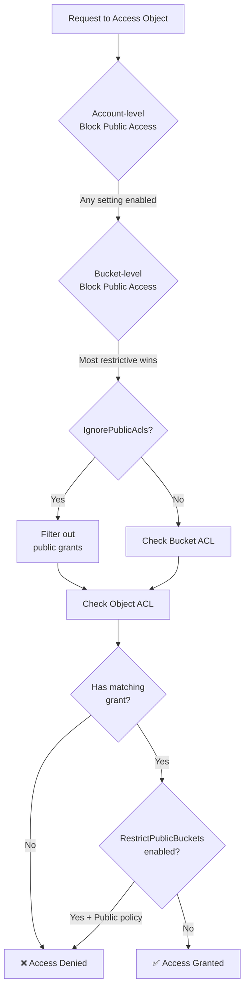

# S3 Public Access, ACLs, and Missing Features

## Overview

This document extends the base [Storage Bucket Ownership and Permissions](./STORAGE-BUCKET-OWNERSHIP-AND-PERMISSIONS.md) system with S3-compatible public access features, canned ACLs, and identifies missing features for full S3 compatibility.

---

## S3 Access Control Layers

AWS S3 provides multiple layered access control mechanisms:

1. **Block Public Access Settings** - Safety net to prevent public exposure
2. **Canned ACLs** - Quick permission templates  
3. **Custom ACLs** - Granular user/group permissions
4. **Bucket Policies** - JSON-based IAM-style policies
5. **Object Ownership** - Control who owns uploaded objects

---

## 1. Block Public Access Settings

### Purpose
Provides four independent settings at account and bucket level to prevent accidental public exposure of data.

### The Four Settings

| Setting | Description | When It Applies |
|---------|-------------|-----------------|
| **BlockPublicAcls** | Prevents setting new public ACLs | PutBucketAcl, PutObjectAcl with public grants |
| **IgnorePublicAcls** | Treats existing public ACLs as non-public | All access requests (ignores AllUsers/AuthenticatedUsers grants) |
| **BlockPublicPolicy** | Prevents setting public bucket policies | PutBucketPolicy with public statements |
| **RestrictPublicBuckets** | Restricts access to public buckets | All access (allows only AWS principals & bucket owner account) |

### Hierarchy

Settings apply at multiple levels with **most restrictive wins**:

```
Organization Level (future)
    ↓
Account Level
    ↓
Bucket Level
    ↓
Object Access (evaluated here)
```

### Database Schema

```sql
-- Bucket-level settings
CREATE TABLE bucket_public_access_settings (
  id TEXT PRIMARY KEY,
  bucket_id TEXT NOT NULL REFERENCES bucket(id) ON DELETE CASCADE,
  block_public_acls BOOLEAN DEFAULT TRUE,
  ignore_public_acls BOOLEAN DEFAULT TRUE,
  block_public_policy BOOLEAN DEFAULT TRUE,
  restrict_public_buckets BOOLEAN DEFAULT TRUE,
  created_at TIMESTAMP DEFAULT NOW(),
  updated_at TIMESTAMP DEFAULT NOW(),
  
  UNIQUE(bucket_id)
);

CREATE INDEX bucket_public_access_bucket_idx ON bucket_public_access_settings(bucket_id);

-- Account-level settings (global default)
CREATE TABLE account_public_access_settings (
  id TEXT PRIMARY KEY DEFAULT 'default',
  block_public_acls BOOLEAN DEFAULT TRUE,
  ignore_public_acls BOOLEAN DEFAULT TRUE,
  block_public_policy BOOLEAN DEFAULT TRUE,
  restrict_public_buckets BOOLEAN DEFAULT TRUE,
  updated_at TIMESTAMP DEFAULT NOW()
);
```

### Implementation

```typescript
interface PublicAccessBlockConfiguration {
  blockPublicAcls: boolean;
  ignorePublicAcls: boolean;
  blockPublicPolicy: boolean;
  restrictPublicBuckets: boolean;
}

class StorageService {
  /**
   * Set bucket-level Block Public Access settings
   */
  async putBucketPublicAccessBlock(
    bucketName: string,
    userId: string,
    config: PublicAccessBlockConfiguration
  ): Promise<void> {
    await this.verifyBucketOwnership(bucketName, userId);
    
    const bucket = await this.repository.getBucketByName(bucketName);
    
    await this.repository.upsertPublicAccessSettings(bucket.id, config);
  }
  
  /**
   * Get effective Block Public Access settings (merges account + bucket)
   * Most restrictive setting wins
   */
  async getBucketPublicAccessBlock(
    bucketName: string
  ): Promise<PublicAccessBlockConfiguration> {
    const bucket = await this.repository.getBucketByName(bucketName);
    const bucketSettings = await this.repository.getPublicAccessSettings(bucket.id);
    const accountSettings = await this.repository.getAccountPublicAccessSettings();
    
    return {
      blockPublicAcls: bucketSettings.blockPublicAcls || accountSettings.blockPublicAcls,
      ignorePublicAcls: bucketSettings.ignorePublicAcls || accountSettings.ignorePublicAcls,
      blockPublicPolicy: bucketSettings.blockPublicPolicy || accountSettings.blockPublicPolicy,
      restrictPublicBuckets: bucketSettings.restrictPublicBuckets || accountSettings.restrictPublicBuckets,
    };
  }
  
  /**
   * Delete bucket Block Public Access settings (revert to account-level)
   */
  async deleteBucketPublicAccessBlock(
    bucketName: string,
    userId: string
  ): Promise<void> {
    await this.verifyBucketOwnership(bucketName, userId);
    
    const bucket = await this.repository.getBucketByName(bucketName);
    await this.repository.deletePublicAccessSettings(bucket.id);
  }
  
  /**
   * Check if a request would be blocked by public access settings
   */
  async validatePublicAccess(
    bucketName: string,
    action: 'put-acl' | 'put-policy' | 'access',
    isPublic: boolean
  ): Promise<void> {
    if (!isPublic) return; // Non-public access always allowed
    
    const settings = await this.getBucketPublicAccessBlock(bucketName);
    
    switch (action) {
      case 'put-acl':
        if (settings.blockPublicAcls) {
          throw new BadRequestException(
            'Cannot set public ACL - BlockPublicAcls is enabled'
          );
        }
        break;
        
      case 'put-policy':
        if (settings.blockPublicPolicy) {
          throw new BadRequestException(
            'Cannot set public bucket policy - BlockPublicPolicy is enabled'
          );
        }
        break;
        
      case 'access':
        if (settings.restrictPublicBuckets) {
          throw new ForbiddenException(
            'Public access to this bucket is restricted'
          );
        }
        break;
    }
  }
}
```

### Contracts

```typescript
// packages/contracts/api/modules/storage/bucket/public-access-block.ts
import { oc } from "@orpc/contract";
import { z } from "zod";

const publicAccessBlockConfigSchema = z.object({
  blockPublicAcls: z.boolean(),
  ignorePublicAcls: z.boolean(),
  blockPublicPolicy: z.boolean(),
  restrictPublicBuckets: z.boolean(),
});

export const bucketPutPublicAccessBlockContract = oc
  .route({
    method: "PUT",
    path: "/{bucketName}/public-access-block",
  })
  .input(
    z.object({
      bucketName: z.string(),
      config: publicAccessBlockConfigSchema,
    })
  )
  .output(z.object({ success: z.boolean() }));

export const bucketGetPublicAccessBlockContract = oc
  .route({
    method: "GET",
    path: "/{bucketName}/public-access-block",
  })
  .input(z.object({ bucketName: z.string() }))
  .output(publicAccessBlockConfigSchema);

export const bucketDeletePublicAccessBlockContract = oc
  .route({
    method: "DELETE",
    path: "/{bucketName}/public-access-block",
  })
  .input(z.object({ bucketName: z.string() }))
  .output(z.object({ success: z.boolean() }));
```

---

## 2. Canned ACLs

### Purpose
Pre-defined ACL templates for quick permission assignment without custom grant lists.

### S3 Canned ACL Types

| Canned ACL | Applies To | Owner | AllUsers | AuthenticatedUsers | Notes |
|-----------|-----------|-------|----------|-------------------|-------|
| **private** | Bucket, Object | FULL_CONTROL | - | - | Default |
| **public-read** | Bucket, Object | FULL_CONTROL | READ | - | Public read access |
| **public-read-write** | Bucket, Object | FULL_CONTROL | READ, WRITE | - | ⚠️ Dangerous |
| **authenticated-read** | Bucket, Object | FULL_CONTROL | - | READ | Any auth user |
| **bucket-owner-read** | Object only | FULL_CONTROL | - | - | Bucket owner gets READ |
| **bucket-owner-full-control** | Object only | FULL_CONTROL | - | - | Bucket owner gets FULL_CONTROL |
| **log-delivery-write** | Bucket only | FULL_CONTROL | - | - | Log delivery group WRITE |

### Predefined Groups

S3 has two special predefined groups:

```typescript
const PREDEFINED_GROUPS = {
  AllUsers: 'http://acs.amazonaws.com/groups/global/AllUsers',
  AuthenticatedUsers: 'http://acs.amazonaws.com/groups/global/AuthenticatedUsers',
} as const;
```

- **AllUsers**: Public access (anyone on the internet)
- **AuthenticatedUsers**: Any authenticated user (any user with an account)

### Database Schema

```sql
-- Bucket ACLs
CREATE TABLE bucket_acl (
  id TEXT PRIMARY KEY,
  bucket_id TEXT NOT NULL REFERENCES bucket(id) ON DELETE CASCADE,
  canned_acl TEXT DEFAULT 'private', -- Canned ACL if using predefined
  custom_grants JSONB, -- Custom grants if not using canned ACL
  updated_at TIMESTAMP DEFAULT NOW(),
  
  UNIQUE(bucket_id)
);

-- Object ACLs
CREATE TABLE object_acl (
  id TEXT PRIMARY KEY,
  object_id TEXT NOT NULL REFERENCES object(id) ON DELETE CASCADE,
  canned_acl TEXT DEFAULT 'private',
  custom_grants JSONB,
  inherits_from_bucket BOOLEAN DEFAULT TRUE,
  updated_at TIMESTAMP DEFAULT NOW(),
  
  UNIQUE(object_id)
);

CREATE INDEX object_acl_object_idx ON object_acl(object_id);
```

### Type Definitions

```typescript
type CannedAcl =
  | 'private'
  | 'public-read'
  | 'public-read-write'
  | 'authenticated-read'
  | 'bucket-owner-read'
  | 'bucket-owner-full-control'
  | 'log-delivery-write';

type AclPermission = 
  | 'READ'           // List bucket / Read object
  | 'WRITE'          // Create/delete objects in bucket
  | 'READ_ACP'       // Read ACL
  | 'WRITE_ACP'      // Write ACL
  | 'FULL_CONTROL';  // All permissions

type GranteeType = 
  | 'CanonicalUser'  // Specific user by ID
  | 'Group';         // Predefined group (AllUsers, AuthenticatedUsers)

interface AclGrant {
  grantee: {
    type: GranteeType;
    id?: string;     // For CanonicalUser
    uri?: string;    // For Group (predefined group URI)
  };
  permission: AclPermission;
}

interface AccessControlList {
  owner: {
    id: string;      // Bucket/object owner user ID
  };
  grants: AclGrant[];
}
```

### Implementation

```typescript
class StorageService {
  /**
   * Expand canned ACL to full grant list
   */
  private expandCannedAcl(
    cannedAcl: CannedAcl,
    ownerId: string,
    bucketOwnerId?: string
  ): AclGrant[] {
    const grants: AclGrant[] = [
      // Owner always gets FULL_CONTROL
      {
        grantee: { type: 'CanonicalUser', id: ownerId },
        permission: 'FULL_CONTROL',
      },
    ];
    
    switch (cannedAcl) {
      case 'public-read':
        grants.push({
          grantee: { type: 'Group', uri: PREDEFINED_GROUPS.AllUsers },
          permission: 'READ',
        });
        break;
        
      case 'public-read-write':
        grants.push(
          {
            grantee: { type: 'Group', uri: PREDEFINED_GROUPS.AllUsers },
            permission: 'READ',
          },
          {
            grantee: { type: 'Group', uri: PREDEFINED_GROUPS.AllUsers },
            permission: 'WRITE',
          }
        );
        break;
        
      case 'authenticated-read':
        grants.push({
          grantee: { type: 'Group', uri: PREDEFINED_GROUPS.AuthenticatedUsers },
          permission: 'READ',
        });
        break;
        
      case 'bucket-owner-read':
        if (bucketOwnerId && bucketOwnerId !== ownerId) {
          grants.push({
            grantee: { type: 'CanonicalUser', id: bucketOwnerId },
            permission: 'READ',
          });
        }
        break;
        
      case 'bucket-owner-full-control':
        if (bucketOwnerId && bucketOwnerId !== ownerId) {
          grants.push({
            grantee: { type: 'CanonicalUser', id: bucketOwnerId },
            permission: 'FULL_CONTROL',
          });
        }
        break;
        
      case 'log-delivery-write':
        // Special group for log delivery (not implemented yet)
        break;
        
      case 'private':
      default:
        // Owner only (already added)
        break;
    }
    
    return grants;
  }
  
  /**
   * Check if canned ACL is public
   */
  private isPublicCannedAcl(acl: CannedAcl): boolean {
    return ['public-read', 'public-read-write', 'authenticated-read'].includes(acl);
  }
  
  /**
   * Check if grant list contains public grants
   */
  private hasPublicGrants(grants: AclGrant[]): boolean {
    return grants.some(grant =>
      grant.grantee.type === 'Group' &&
      (grant.grantee.uri === PREDEFINED_GROUPS.AllUsers ||
       grant.grantee.uri === PREDEFINED_GROUPS.AuthenticatedUsers)
    );
  }
  
  /**
   * Set bucket ACL (canned or custom)
   */
  async putBucketAcl(
    bucketName: string,
    userId: string,
    acl: CannedAcl | AccessControlList
  ): Promise<void> {
    await this.verifyBucketOwnership(bucketName, userId);
    
    const bucket = await this.repository.getBucketByName(bucketName);
    
    // Check Block Public Access settings
    if (typeof acl === 'string') {
      if (this.isPublicCannedAcl(acl)) {
        await this.validatePublicAccess(bucketName, 'put-acl', true);
      }
      
      await this.repository.setBucketCannedAcl(bucket.id, acl);
    } else {
      if (this.hasPublicGrants(acl.grants)) {
        await this.validatePublicAccess(bucketName, 'put-acl', true);
      }
      
      await this.repository.setBucketCustomAcl(bucket.id, acl);
    }
  }
  
  /**
   * Get bucket ACL (respects IgnorePublicAcls setting)
   */
  async getBucketAcl(bucketName: string): Promise<AccessControlList> {
    const bucket = await this.repository.getBucketByName(bucketName);
    const aclRecord = await this.repository.getBucketAcl(bucket.id);
    
    // Expand canned ACL if used
    const grants = aclRecord.cannedAcl
      ? this.expandCannedAcl(aclRecord.cannedAcl, bucket.ownerId)
      : aclRecord.customGrants;
    
    // Check IgnorePublicAcls setting
    const publicAccessBlock = await this.getBucketPublicAccessBlock(bucketName);
    
    const effectiveGrants = publicAccessBlock.ignorePublicAcls
      ? grants.filter(grant => !this.isPublicGrant(grant))
      : grants;
    
    return {
      owner: { id: bucket.ownerId },
      grants: effectiveGrants,
    };
  }
  
  /**
   * Set object ACL (canned or custom)
   */
  async putObjectAcl(
    bucketName: string,
    objectKey: string,
    userId: string,
    acl: CannedAcl | AccessControlList
  ): Promise<void> {
    await this.verifyBucketOwnership(bucketName, userId);
    
    const object = await this.repository.getObject(bucketName, objectKey);
    const bucket = await this.repository.getBucketByName(bucketName);
    
    // Check Block Public Access
    if (typeof acl === 'string') {
      if (this.isPublicCannedAcl(acl)) {
        await this.validatePublicAccess(bucketName, 'put-acl', true);
      }
      
      await this.repository.setObjectCannedAcl(object.id, acl);
    } else {
      if (this.hasPublicGrants(acl.grants)) {
        await this.validatePublicAccess(bucketName, 'put-acl', true);
      }
      
      await this.repository.setObjectCustomAcl(object.id, acl);
    }
  }
  
  /**
   * Get object ACL
   */
  async getObjectAcl(bucketName: string, objectKey: string): Promise<AccessControlList> {
    const object = await this.repository.getObject(bucketName, objectKey);
    const bucket = await this.repository.getBucketByName(bucketName);
    const aclRecord = await this.repository.getObjectAcl(object.id);
    
    // If object inherits from bucket, get bucket ACL
    if (aclRecord.inheritsFromBucket) {
      return this.getBucketAcl(bucketName);
    }
    
    // Expand canned ACL if used
    const grants = aclRecord.cannedAcl
      ? this.expandCannedAcl(aclRecord.cannedAcl, object.ownerId, bucket.ownerId)
      : aclRecord.customGrants;
    
    // Apply IgnorePublicAcls
    const publicAccessBlock = await this.getBucketPublicAccessBlock(bucketName);
    const effectiveGrants = publicAccessBlock.ignorePublicAcls
      ? grants.filter(grant => !this.isPublicGrant(grant))
      : grants;
    
    return {
      owner: { id: object.ownerId || bucket.ownerId },
      grants: effectiveGrants,
    };
  }
  
  private isPublicGrant(grant: AclGrant): boolean {
    return grant.grantee.type === 'Group' &&
      (grant.grantee.uri === PREDEFINED_GROUPS.AllUsers ||
       grant.grantee.uri === PREDEFINED_GROUPS.AuthenticatedUsers);
  }
}
```

---

## 3. Object Ownership

### Purpose
Control who owns objects uploaded to a bucket, affecting ACL management and access control.

### Three Ownership Models

| Setting | Who Owns Object | ACLs Allowed | Use Case |
|---------|----------------|--------------|----------|
| **BucketOwnerEnforced** | Bucket owner (always) | ❌ No | Simplified permissions |
| **BucketOwnerPreferred** | Bucket owner if `bucket-owner-full-control` ACL used | ✅ Yes | Shared upload buckets |
| **ObjectWriter** | Uploader | ✅ Yes | Traditional S3 behavior |

### Database Schema

```sql
ALTER TABLE bucket ADD COLUMN object_ownership TEXT DEFAULT 'BucketOwnerPreferred';
-- Values: 'BucketOwnerEnforced' | 'BucketOwnerPreferred' | 'ObjectWriter'

-- Track original uploader even when ownership transfers
ALTER TABLE object ADD COLUMN uploader_id TEXT;
ALTER TABLE object ADD COLUMN owner_id TEXT;

CREATE INDEX object_uploader_idx ON object(uploader_id);
CREATE INDEX object_owner_idx ON object(owner_id);
```

### Implementation

```typescript
type ObjectOwnership = 
  | 'BucketOwnerEnforced'
  | 'BucketOwnerPreferred'
  | 'ObjectWriter';

class StorageService {
  async uploadObject(
    bucketName: string,
    key: string,
    userId: string,
    data: Buffer,
    options?: {
      acl?: CannedAcl;
      contentType?: string;
      metadata?: Record<string, string>;
    }
  ): Promise<void> {
    const bucket = await this.repository.getBucketByName(bucketName);
    
    // Determine object owner based on bucket's object ownership setting
    let objectOwnerId: string;
    
    switch (bucket.objectOwnership) {
      case 'BucketOwnerEnforced':
        // Bucket owner always owns objects
        objectOwnerId = bucket.ownerId;
        
        // ACLs are disabled with BucketOwnerEnforced
        if (options?.acl && options.acl !== 'private') {
          throw new BadRequestException(
            'ACLs are disabled for this bucket (BucketOwnerEnforced)'
          );
        }
        break;
        
      case 'BucketOwnerPreferred':
        // Bucket owner owns if 'bucket-owner-full-control' ACL specified
        objectOwnerId = options?.acl === 'bucket-owner-full-control'
          ? bucket.ownerId
          : userId;
        break;
        
      case 'ObjectWriter':
      default:
        // Uploader owns object
        objectOwnerId = userId;
        break;
    }
    
    // Create object record
    const object = await this.repository.createObject({
      bucketId: bucket.id,
      key,
      ownerId: objectOwnerId,
      uploaderId: userId,
      size: data.length,
      etag: this.calculateETag(data),
      contentType: options?.contentType || 'application/octet-stream',
      metadata: options?.metadata,
    });
    
    // Set object ACL if specified
    if (options?.acl) {
      await this.repository.setObjectCannedAcl(object.id, options.acl);
    } else {
      // Inherit from bucket by default
      await this.repository.setObjectInheritsBucket(object.id, true);
    }
    
    // Write to filesystem
    await this.writeObjectData(bucket.id, key, data);
  }
}
```

---

## Missing Features Analysis

### 🔴 HIGH PRIORITY (Required for S3 Compatibility)

| Feature | Status | Effort | Description |
|---------|--------|--------|-------------|
| **Block Public Access** | ⏳ Pending | Medium | 4 settings to prevent public exposure |
| **Canned ACLs** | ⏳ Pending | Medium | private, public-read, public-read-write, etc. |
| **GetBucketAcl / PutBucketAcl** | ⏳ Pending | Low | Read/write bucket ACLs |
| **GetObjectAcl / PutObjectAcl** | ⏳ Pending | Low | Read/write object ACLs |
| **Object Ownership** | ⏳ Pending | Low | BucketOwnerEnforced setting |

### 🟡 MEDIUM PRIORITY (Common Use Cases)

| Feature | Status | Effort | Description |
|---------|--------|--------|-------------|
| **Static Website Hosting** | ❌ Missing | Medium | Serve buckets as websites |
| **CORS Configuration** | ❌ Missing | Low | Cross-origin resource sharing |
| **Bucket Policies** | ❌ Missing | High | JSON IAM-style policies |
| **Presigned POST** | ⏳ Pending | Low | Browser upload forms |
| **Bucket Lifecycle** | ❌ Missing | Medium | Auto-delete old objects |

### 🟢 LOW PRIORITY (Advanced/Enterprise)

| Feature | Status | Effort | Description |
|---------|--------|--------|-------------|
| **Versioning** | ❌ Missing | High | Keep multiple object versions |
| **Object Lock** | ❌ Missing | High | WORM compliance mode |
| **Replication** | ❌ Missing | Very High | Cross-region sync |
| **Storage Classes** | ❌ Missing | High | STANDARD, GLACIER, etc. |
| **Inventory** | ❌ Missing | Medium | Scheduled reports |

---

## Implementation Roadmap

### Phase 1: Public Access Foundation ✅ (Current Sprint)
- [x] Bucket ownership with ownerId
- [x] Multipart expiry index
- [ ] Block Public Access (4 settings)
- [ ] Canned ACLs (6 types)
- [ ] Object ownership (BucketOwnerEnforced)
- [ ] PutBucketAcl / GetBucketAcl endpoints
- [ ] PutObjectAcl / GetObjectAcl endpoints

### Phase 2: Static Websites & CORS 🚧 (Next Sprint)
- [ ] Static website configuration
- [ ] Index/error document serving
- [ ] CORS rules configuration
- [ ] CORS preflight handling
- [ ] Content-Type detection

### Phase 3: Bucket Policies 🔮 (Future)
- [ ] JSON policy parser
- [ ] Policy evaluation engine
- [ ] IAM-style conditions (IpAddress, etc.)
- [ ] Principal matching (users, groups, services)
- [ ] PutBucketPolicy / GetBucketPolicy

### Phase 4: Advanced Features 🔮 (Long-term)
- [ ] Object versioning
- [ ] Lifecycle policies
- [ ] Cross-region replication
- [ ] Storage classes
- [ ] Object locking (compliance)

---

## Public Access Decision Tree



---

## Public Bucket Examples

### Example 1: CDN Assets Bucket

```typescript
// Create public CDN bucket
await api.storage.bucket.create.call({ name: 'cdn-assets' });

// Disable Block Public Access for this bucket
await api.storage.bucket.putPublicAccessBlock.call({
  bucketName: 'cdn-assets',
  config: {
    blockPublicAcls: false,
    ignorePublicAcls: false,
    blockPublicPolicy: false,
    restrictPublicBuckets: false,
  },
});

// Set public-read ACL
await api.storage.bucket.putAcl.call({
  bucketName: 'cdn-assets',
  acl: 'public-read',
});

// Upload objects - they're publicly accessible
await api.storage.object.upload.call({
  bucket: 'cdn-assets',
  key: 'logo.png',
  data: logoBuffer,
});

// Access: https://cdn-assets.storage.nestio.com/logo.png
```

### Example 2: Shared Upload Bucket

```typescript
// Create bucket with BucketOwnerPreferred
await api.storage.bucket.create.call({
  name: 'user-uploads',
  objectOwnership: 'BucketOwnerPreferred',
});

// Users upload with bucket-owner-full-control ACL
await api.storage.object.upload.call({
  bucket: 'user-uploads',
  key: `user-${userId}/photo.jpg`,
  data: photoBuffer,
  acl: 'bucket-owner-full-control', // Transfers ownership
});

// Bucket owner now owns and can manage the object
```

### Example 3: Static Website

```typescript
// Create website bucket
await api.storage.bucket.create.call({ name: 'my-website' });

// Configure as website
await api.storage.bucket.putWebsite.call({
  bucketName: 'my-website',
  indexDocument: 'index.html',
  errorDocument: '404.html',
});

// Make public
await api.storage.bucket.putPublicAccessBlock.call({
  bucketName: 'my-website',
  config: {
    blockPublicAcls: false,
    ignorePublicAcls: false,
    blockPublicPolicy: false,
    restrictPublicBuckets: false,
  },
});

await api.storage.bucket.putAcl.call({
  bucketName: 'my-website',
  acl: 'public-read',
});

// Access: https://my-website.storage.nestio.com/
```

---

## Security Best Practices

### 1. Default to Private
- All new buckets should have Block Public Access enabled by default
- Require explicit opt-in for public access
- Log all changes to public access settings

### 2. Account-Level Protection
```typescript
// Enable Block Public Access at account level
await api.storage.account.putPublicAccessBlock.call({
  config: {
    blockPublicAcls: true,
    ignorePublicAcls: true,
    blockPublicPolicy: true,
    restrictPublicBuckets: true,
  },
});
```

### 3. Audit Public Buckets
```typescript
// Regular audit of public buckets
const publicBuckets = await api.storage.bucket.listPublic.call();

for (const bucket of publicBuckets) {
  logger.warn(`Public bucket: ${bucket.name}`, {
    acl: bucket.acl,
    publicAccessBlock: bucket.publicAccessBlock,
  });
}
```

### 4. Least Privilege
- Use `public-read` instead of `public-read-write` when possible
- Avoid `AllUsers` WRITE permission (allows anyone to upload/delete)
- Prefer `authenticated-read` over `public-read` if users must authenticate

### 5. Temporary Public Access
```typescript
// Make object public temporarily via presigned URL instead of ACL
const presignedUrl = await api.storage.object.presignedGetUrl.call({
  bucket: 'private-bucket',
  key: 'document.pdf',
  expiresIn: 3600, // 1 hour
});

// Share presigned URL instead of making object public
```

---

## Integration with Existing Permission System

The Block Public Access and ACL system **complements** the role-based permission system:

```typescript
// Check flow for object access:
async checkObjectAccess(
  bucketName: string,
  objectKey: string,
  userId: string | null,
  operation: 'read' | 'write'
): Promise<boolean> {
  // 1. Check Block Public Access settings
  const publicAccessBlock = await this.getBucketPublicAccessBlock(bucketName);
  
  // 2. If user is authenticated, check role-based permissions first
  if (userId) {
    const hasRolePermission = await this.verifyBucketAccess(
      bucketName,
      userId,
      'object',
      [operation]
    );
    
    if (hasRolePermission) return true;
  }
  
  // 3. Check ACLs for public/anonymous access
  const objectAcl = await this.getObjectAcl(bucketName, objectKey);
  
  // 4. Apply IgnorePublicAcls if enabled
  const effectiveGrants = publicAccessBlock.ignorePublicAcls
    ? objectAcl.grants.filter(g => !this.isPublicGrant(g))
    : objectAcl.grants;
  
  // 5. Check if grants allow the operation
  const permission = operation === 'read' ? 'READ' : 'WRITE';
  
  return effectiveGrants.some(grant => {
    if (!userId && grant.grantee.type === 'Group' && 
        grant.grantee.uri === PREDEFINED_GROUPS.AllUsers) {
      return grant.permission === permission || grant.permission === 'FULL_CONTROL';
    }
    
    if (userId && grant.grantee.type === 'Group' &&
        grant.grantee.uri === PREDEFINED_GROUPS.AuthenticatedUsers) {
      return grant.permission === permission || grant.permission === 'FULL_CONTROL';
    }
    
    if (userId && grant.grantee.type === 'CanonicalUser' &&
        grant.grantee.id === userId) {
      return grant.permission === permission || grant.permission === 'FULL_CONTROL';
    }
    
    return false;
  });
}
```

**Priority Order:**
1. Block Public Access (safety net)
2. Role-based permissions (for authenticated users)
3. ACLs (for public/anonymous access)
4. Bucket policies (future - most flexible)
